# Figure captions

All five figures share one visual grammar: the **first panel orients** you to the
kind of data or the pipeline, the **middle panels are the data**, and the **last
panel summarizes the interpretation**. Colors are consistent throughout —
**red = the inflammatory "accelerator" program**, **blue = the "brake"
(resolution) program**, **purple = astrocytes**, **slate = human genetics**,
**amber = the shared conclusion**. Every number in these captions is computed
from public data during the event; nothing is carried over from prior analyses.

---

## Figure 1 — One shared accelerator axis, seen three independent ways

The hook. A single microglial inflammation program ("the accelerator") shows up
in Alzheimer's disease and in brain injury, reproduces across species and
methods, and sits on DNA that carries a large share of inherited Alzheimer's risk.

- **A — The pipeline.** How the analysis runs: score the accelerator program in
  single-cell and bulk RNA, test it across independent datasets, then map it onto
  Alzheimer's genetics.
- **B — The accelerator is a real module.** Its genes switch on and off together
  far more than expected by chance (gene–gene co-activity 0.074 vs a random-gene
  null of 0.013; p < 0.01). The brake program does not cohere in single-nucleus
  data — an honest limitation addressed in the text.
- **C — The same genes go up in both diseases.** Each dot is one accelerator
  gene; red dots (e.g. *SPP1/OPN, APOE, TLR2, TNF, LPL*) rise in both Alzheimer's
  (x-axis) and brain injury (y-axis).
- **D — It reproduces.** Accelerator effect size (Cohen's d ± 95% CI) is positive
  in human single-nucleus (SEA-AD), mouse single-nucleus (CEREBRI), independent of
  the underpowered human bulk set (Marinaro) — two species, three methods.
- **E — The DNA carries the risk.** Microglial regulatory DNA is ~1.5% of the
  genome yet accounts for 31.4% of inherited Alzheimer's risk (p = 1×10⁻⁵).
- **F — The conclusion.** The accelerator program (SPP1, APOE, TREM2, TYROBP, C1q,
  C3, ITGAX, GPNMB, CST7, LPL, TLR2, CD68, B2M, IL1B, TNF), supported by three
  independent lines of evidence: recovered blindly, up in both diseases, and
  enriched for inherited risk.

---

## Figure 2 — Where the accelerator turns on, and when

The accelerator concentrates exactly where the tissue is damaged, in both
diseases, shown here on real tissue.

- **A — Alzheimer's tissue (Stereo-seq).** A mouse Alzheimer's brain section; each
  spot is colored by its accelerator score, with amyloid plaques overlaid in gray.
  The program is brightest on and around plaques.
- **B — Quantified for Alzheimer's.** Accelerator score by distance from the
  nearest plaque: highest on-plaque (0.428), falling with distance (0.247 beyond
  400 µm).
- **C — Injured tissue (Visium).** A mouse brain-injury section; spots colored by
  accelerator score. The program lights up at the injury lesion (the lesion tracks
  a tissue-damage signature, ρ = 0.65).
- **D — Quantified for injury.** Accelerator score by distance from the lesion:
  highest at the lesion (+0.102), falling to background farther away (−0.061).
  Plaque (B) and lesion (D) are plotted near-injury-first so the two diseases line
  up.
- **E — How we measured it.** Spots are binned into rings by distance from the
  plaque or lesion, and the score is averaged per ring (panels B and D).

*Timing (from the CEREBRI injury time-course, described in the text): the
microglial accelerator peaks around 7 days after injury (score ~1.24, up from
~0.77 at 24 h, settling to ~0.70 by 6 months), while the brake stays essentially
flat near zero at every time point — the brake is a phase that never fully engages.*

---

## Figure 3 — Inherited risk sets the threshold; injury pulls the trigger

The genetics. Inherited Alzheimer's risk and the environmentally-installed
accelerator effectors are largely *different* genes.

- **A — How a risk variant reaches a gene.** An inherited variant sits in a DNA
  switch; if that switch is more open, a loop connects it to a gene, changing the
  gene's expression. Each accelerator gene is scored on all four layers.
- **B — The four-layer map.** For every accelerator gene, its inherited-risk
  signal, how open its switch is, its enhancer→gene loop, and its expression.
- **C — The positive-control test.** Only *APOE* and *TREM2* clear genome-wide
  significance for inherited risk (dashed line). The accelerator *effectors*
  (*SPP1, CD68, TLR2* …) do not — even where their DNA switches are strong (e.g.
  *SPP1*). The control works, and it shows the effectors are not themselves
  inherited-risk genes.
- **D — The asymmetry.** Accelerator genes carry more inherited AD-risk signal
  (1.48×) than the brake genes (1.09×).
- **E — The conclusion.** Inherited risk sets the *threshold* (APOE, TREM2);
  injury and environment pull the *trigger* (SPP1 and the effectors, which carry
  no common risk variants). Trigger ≠ threshold.

---

## Figure 4 — The master-control proteins that switch the accelerator on and off

Which regulatory proteins turn the accelerator program up or down, read directly
off the DNA by an AI model that predicts how open each stretch of microglial DNA is.

- **A — What the model reads.** A microglial enhancer (a stretch of open DNA that
  controls nearby genes) carries binding sites for several master-control proteins
  (SPI1, NFκB, MEF2C, CEBPB). We delete one site at a time and watch the DNA close.
- **B — Who does what.** Removing **NFκB** specifically closes the accelerator DNA
  (p = 1.9×10⁻⁵) — it is the activator. Removing **SPI1** or **CEBPB** closes
  *both* programs equally — they are identity proteins the cell needs to be a
  microglia at all, not accelerator-specific switches.
- **C — SPI1 dose-response.** The stronger a DNA site's SPI1 signal, the more
  accessibility is lost when SPI1 is removed (ρ = −0.28, p = 9×10⁻¹⁵). The y-axis
  is a signed change that crosses zero, so it is shown on a linear scale.
- **D — Along the path from resting to inflamed.** Accelerator genes (*GPNMB,
  SPP1*) rise and resting/brake genes (*P2RY12, MEF2C, TMEM119*) fall as microglia
  progress toward the disease state.
- **E — The wiring.** NFκB (activator) switches the accelerator ON; MEF2C
  (repressor) holds it OFF; SPI1/CEBPB are required identity proteins upstream of
  both.

---

## Figure 5 — CD44: the receptor where the accelerator and the brake meet

The shared hub. Microglia and astrocytes both signal through one receptor, CD44,
and under injury the brake fails.

- **A — Who expresses what.** Detection of hub genes in microglia vs astrocytes
  (dot size = fraction of cells expressing; color = average level).
- **B — The astrocyte brake fails under injury.** In sorted astrocytes after
  injury, almost everything rises — SPP1, CD44 (+1.04), HAS2 (+0.76), HMMR — while
  the one pro-resolving brake gene, TSG-6/*Tnfaip6*, is the lone gene that falls
  (−0.34, p = 0.03).
- **C — CD44 rises across four modalities and both species.** The receptor itself
  goes up in sorted-astrocyte bulk RNA under injury (+1.0 log₂), human AD brain
  protein (+0.26 log₂), the mouse plaque-microenvironment proteome (+0.72 log₂),
  and single-nucleus microglia under injury (+0.13) — the most consistent single
  observation in the study (** p < 0.01, * p < 0.05, † p < 0.1).
- **D — The conclusion.** Every accelerator input to CD44 goes up while the brake
  input goes down: the receptor is pushed and never released. CD44 is a concrete,
  lab-testable therapeutic node.

---

# Extended Data figures

These supplementary panels strengthen the resolution/brake arm. All numbers are
computed here from public data.

## Extended Data Figure 1 — The hyaluronan brake: what we can and cannot see

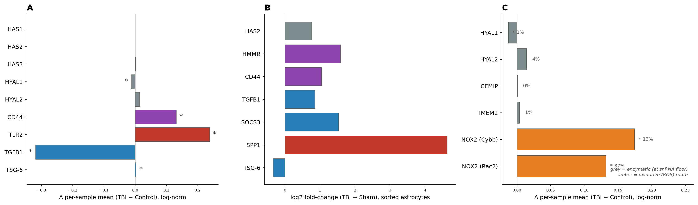

- **A — HA machinery in single-nucleus microglia (CEREBRI TBI).** The synthesis
  and turnover enzymes (*HAS1–3*, *HYAL1/2*) sit at the detection floor, so the
  enzyme-level switch is not resolvable in snRNA; what *is* visible is the
  downstream consequence the switch predicts — the low-molecular-weight-HA sensor
  *TLR2* rises, the receptor CD44 rises, and the brake ligand *TGFB1* falls
  (* p < 0.05).
- **B — Sorted-astrocyte bulk RNA (TBI).** With bulk sensitivity the enzyme *HAS2*
  and the receptor CD44 rise, but the crosslinker TSG-6 falls — synthesis without
  the HMW-stabilizing brake.
- **C — Four routes to fragment HA, in TBI microglia.** Of the enzymatic degraders,
  *HYAL1/2*, *CEMIP* and *TMEM2* are all at or near the detection floor (grey; % of
  cells detecting shown), so the enzymatic switch is unmeasurable in snRNA. The
  non-enzymatic **oxidative route is the exception** — NADPH-oxidase *CYBB* (+0.17,
  p < 10⁻⁴) and its assembly factor *RAC2* (+0.13, p = 0.03) are induced (amber).
  We measure the fragmentation *machinery*, not HA fragment size itself; that HA is
  degraded to pro-inflammatory fragments after brain injury is established in the
  literature.

## Extended Data Figure 2 — Accelerator-versus-brake imbalance

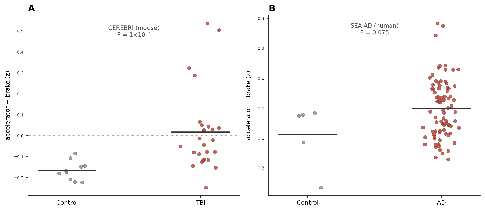

Per-sample module imbalance (accelerator − brake, z-scored) shifts toward the
accelerator in disease/injury in both datasets: CEREBRI mouse TBI (Δ +0.18,
P = 1×10⁻⁴) and SEA-AD human AD (Δ +0.09, P = 0.075; limited by 5 control donors).

## Extended Data Figure 3 — Brake-module reproducibility

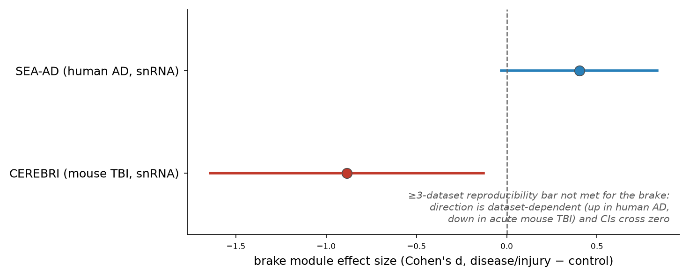

The brake module does not clear the pre-specified ≥3-dataset bar: its effect is
positive in human AD (d = +0.40) but negative in acute mouse TBI (d = −0.89), and
confidence intervals cross zero. This dataset-dependence — brake behaviour differs
between chronic disease and acute injury — is itself informative and is reported
openly rather than averaged away.

## Extended Data Figure 4 — Chronic human repetitive head impact (CTE)

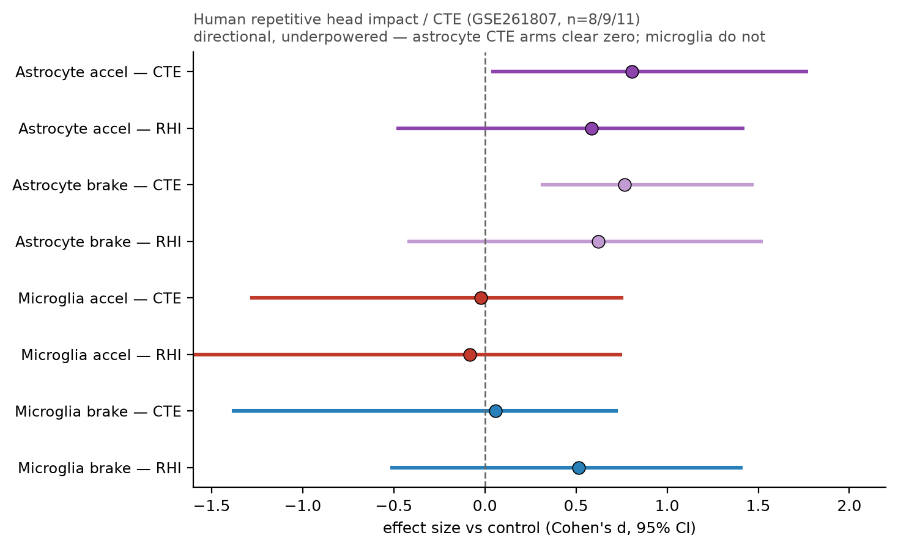

Independent test in human repetitive-head-impact and chronic traumatic
encephalopathy cortex (GSE261807; n = 8 control / 9 repetitive-head-impact /
11 CTE), scored as effect size versus control (Cohen's d, 95% CI). The astrocyte
arms clear zero in CTE (accelerator d = 0.81; brake d = 0.77), whereas the
microglial accelerator does not (d ≈ 0, CI spans zero) — the microglial
subpopulation signal is washed out in a whole-population comparison of a small,
variable human cohort. The cohort is directional and underpowered; it is shown
honestly rather than over-interpreted, and it is the chronic-injury human anchor
for the cross-species claim.

---

*The next three panels are the genetic anchor summarised in Figure 3, shown
individually.*

## Extended Data Figure 5 — AD variants concentrate in accelerator enhancers

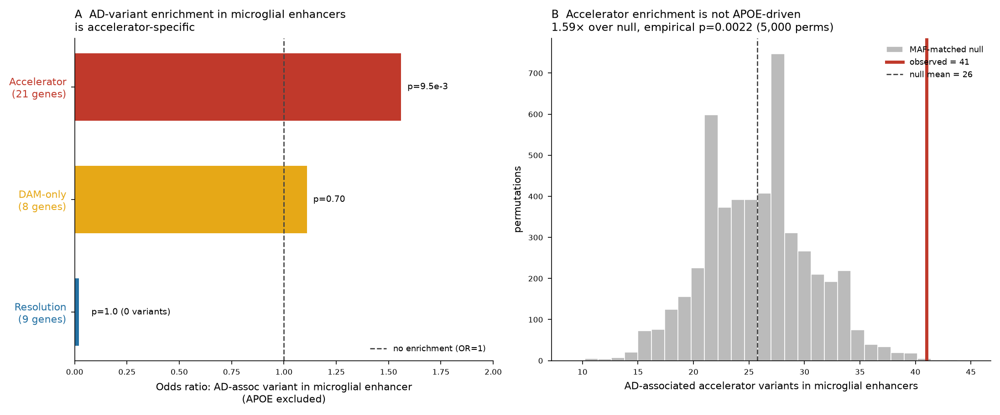

AD-associated common variants are enriched in microglial enhancers of the
accelerator genes (odds ratio 1.56, Fisher P = 1×10⁻⁴; 96 associated variants in
enhancers). The enrichment survives excluding the *APOE* region (OR 1.56,
P = 9.5×10⁻³) and a minor-allele-frequency-matched permutation null (1.59-fold,
P = 0.0022), so it is not driven by *APOE* alone. The resolution arm shows no
enrichment (OR = 0), and a DAM-only contrast is not significant (OR 1.11) — the
signal is specific to the accelerator module.

## Extended Data Figure 6 — Risk alleles disrupt microglial chromatin

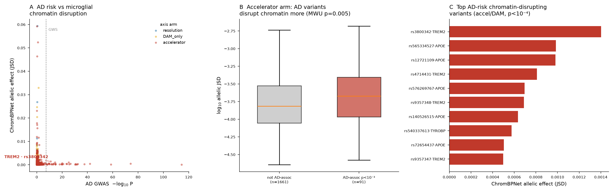

A ChromBPNet model of microglial chromatin predicts the allele-specific effect of
each variant on local accessibility. Within the accelerator arm, AD-associated
variants disrupt predicted accessibility more than non-associated variants in the
same enhancers (Mann–Whitney P = 0.005). The strongest single effect is
rs3800342 at *TREM2* (P = 9.3×10⁻¹²). This is an allele-level, mechanism-of-action
readout: the risk alleles act on the DNA the accelerator program uses.

## Extended Data Figure 7 — Microglial DNA carries a large share of AD heritability

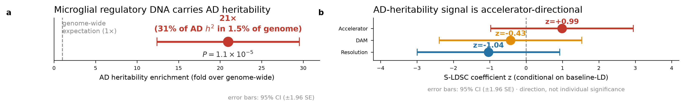

Stratified LD-score regression on the Bellenguez AD GWAS. Microglial regulatory
DNA is ~1.5% of the genome yet accounts for 31.4% of common-variant AD heritability
(20.96-fold enrichment, P = 1.1×10⁻⁵; conditional coefficient z = 3.62). The
narrower accelerator-, DAM-, and resolution-enhancer annotations are each too small
to reach significance on their own (accelerator enrichment P = 0.32), so the
well-powered statement is at the level of microglial regulatory DNA as a whole —
stated at the resolution the data support.

---

*The next two panels are the causal-direction (colocalization) analyses behind the
"inherited risk enters upstream" argument in Figure 3.*

## Extended Data Figure 8 — Cell-type-matched eQTL colocalization

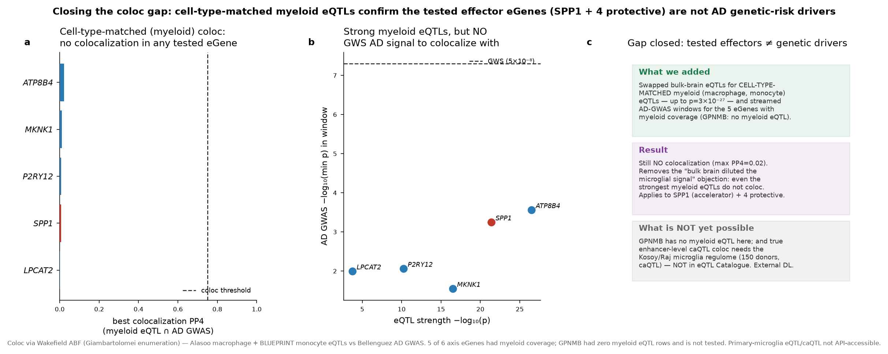

Colocalization of AD GWAS with myeloid (macrophage/monocyte) expression QTLs — the
cell-type-matched test that removes the "bulk-brain dilution" objection. Despite
strong eQTLs for the effector genes (e.g. *SPP1*, *ATP8B4*), no accelerator
effector colocalizes with AD risk (maximum PP4 = 0.009 across the tested genes). The effector genes are
where the program acts, not where inherited risk enters.

## Extended Data Figure 9 — Enhancer-level (caQTL) and three-way colocalization

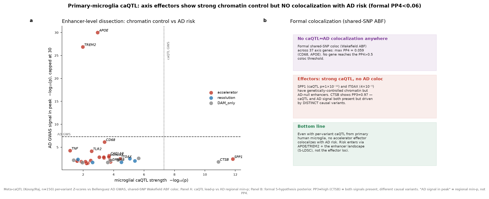

Microglial chromatin-accessibility QTLs resolve the same split at the enhancer
level: accelerator/effector enhancers have strong caQTLs (e.g. *SPP1*
caQTL P = 1.5×10⁻¹²) but the AD signal in those same peaks is weak (regional
minimum P ≈ 3.7×10⁻³, not genome-wide significant). In a joint caQTL–eQTL–GWAS
test, the strongest sharing is between accessibility and expression at *C1QA*
(PP4 = 0.18), while sharing of either signal with AD risk stays near zero
(maximum PP4 ≈ 0.06) — regulated effectors, but not GWAS-driven. Only *APOE* and
*TREM2* carry genome-wide-significant inherited risk; the effectors are installed
downstream — *trigger ≠ threshold*.

---

*The next two panels are the regulatory-logic analyses behind Figure 4.*

## Extended Data Figure 10 — In-silico motif ablation

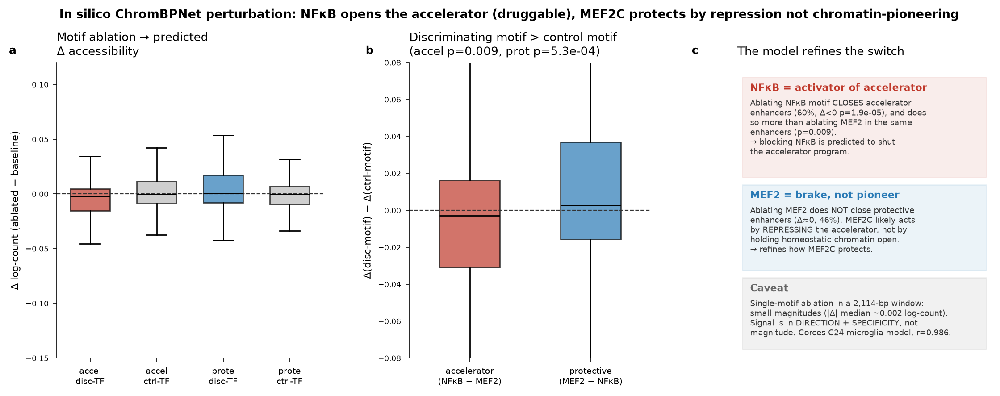

Deleting transcription-factor motifs one at a time in the ChromBPNet model and
measuring the predicted loss of accessibility across 754 enhancers (310 accelerator,
444 resolution). Removing **NF-κB** specifically closes accelerator enhancers
(mean Δ = −0.029, P = 1.9×10⁻⁵), identifying it as the arm-specific activator;
removing **SPI1** produces a dose-dependent loss scaling with motif strength
(ρ = −0.28, P = 9×10⁻¹⁵) but closes both arms, marking it (with CEBPB) as a
required identity factor rather than an accelerator-specific switch.

## Extended Data Figure 11 — Pseudotime trajectory

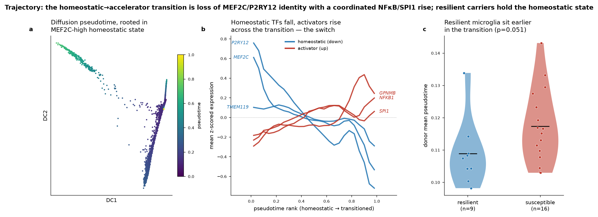

Along the microglial resting-to-inflamed pseudotime, accelerator genes rise
(*GPNMB* ρ = +0.16, *SPP1* ρ = +0.05, *NFKB1* ρ = +0.10) and homeostatic/brake
genes fall (*P2RY12* ρ = −0.37, *MEF2C* ρ = −0.22, *TMEM119* ρ = −0.08). The
overall accelerator transition runs opposite to the homeostatic state (ρ = −0.49),
consistent with a single axis progressing from resting to disease-associated.
