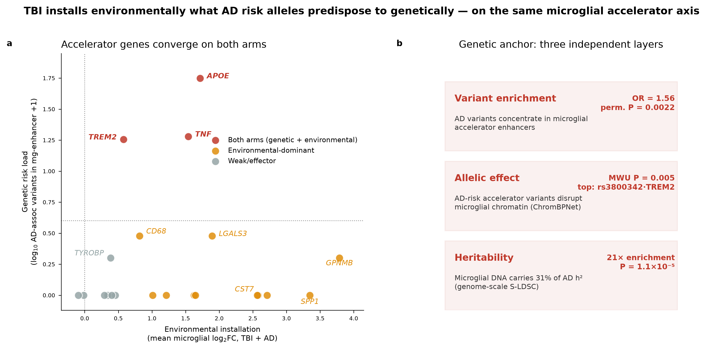
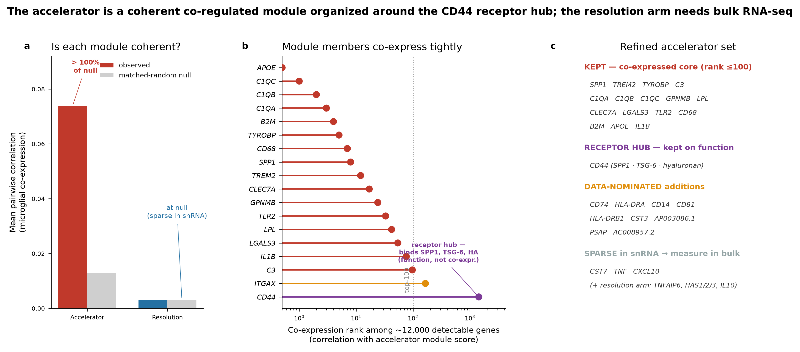

# Genetically anchoring the shared TBI–AD microglial axis

**A cross-modality, cross-species test of whether the same microglial
inflammatory program that traumatic brain injury (TBI) *installs* is the one
that Alzheimer's disease (AD) risk alleles *predispose to* — computed from
public data.**

> **One-sentence thesis.** TBI installs environmentally what AD risk alleles
> predispose to genetically, and both converge on the same microglial
> **accelerator** axis (OPN/SPP1 · TREM2 · APOE · complement), while the
> pro-resolving **brake** arm (TSG-6/TNFAIP6 · CD44) stays disengaged.

This repository contains the **genetic-anchoring arm** of the analysis: a
three-layer test that AD common-variant genetics converges on microglial
regulatory DNA, and specifically on the *accelerator* gene module rather than
the *resolution* module. It is built to be reproducible from public data with
an OSI-approved (MIT) license.

---

## The result in one figure



*Accelerator genes sit high on **both** the environmental axis (installed by
TBI and AD in single-nucleus data) and the genetic axis (carrying AD risk
variants in microglial enhancers). The upstream microglial switches —* TREM2,
APOE, TNF *— carry the genetic load (≥3 AD risk variants each); the effectors —*
SPP1/OPN, the C1q complement genes, C3, TLR2 *— are installed environmentally
(up in AD and/or TBI microglia, few common risk variants).*

---

## Are the gene modules real, or just a curated guess?

The accelerator/resolution axis is **hypothesis-driven** — defined *a priori* from
the DAM/neuroinflammation literature and the pro-resolving TSG-6→CD44 mechanism,
**not** derived from the datasets it is tested on. Two independent robustness
checks confirm it holds up, and one honest limitation is stated plainly:



*The accelerator genes co-vary as a genuine module (beating 100% of
detection-matched random sets) and re-emerge in unsupervised NMF; the module is
organized around **CD44**, the receptor where the accelerator ligand SPP1/OPN and
the brake ligand TSG-6 compete. The resolution arm is near-undetectable in
single-nucleus RNA — its quantification requires bulk RNA-seq
(`results/refined_accelerator_geneset.csv`).*

---

## Three independent genetic layers

| Layer | Question | Result | Figure |
|-------|----------|--------|--------|
| **1 · Variant enrichment** | Do AD-associated variants concentrate in microglial *accelerator*-gene enhancers? | **OR = 1.56**, MAF-matched permutation **P = 0.0022** (1.59× over null); APOE-excluded P = 9.5×10⁻³; resolution arm OR = 0 | `figures/enrichment_results.png` |
| **2 · Allelic chromatin effect** | Do those variants change predicted microglial chromatin accessibility? | AD-associated accelerator variants disrupt chromatin more than non-associated (**ChromBPNet, Mann-Whitney P = 0.005**); top hit **rs3800342** in the *TREM2* enhancer (AD P = 9.3×10⁻¹²) | `figures/chrombpnet_results.png` |
| **3 · Partitioned heritability** | What fraction of AD SNP-heritability sits in microglial regulatory DNA? | Microglial peaks (1.5% of genome) carry **31% of AD h²** — **21× enrichment, P = 1.1×10⁻⁵**; conditional coefficient z = 3.62. Within axis enhancers the signal is **accelerator-specific** (z = +0.99) vs resolution (z = −1.04) | `figures/sldsc_heritability.png` |

Supporting GWAS locus map: `figures/gwas_axis_loci.png`.

---

## Why this matters

Epidemiology links moderate-to-severe TBI to elevated dementia risk, but the
*mechanism* has been a black box. Here we show, from public data computed during
the event, that TBI and AD engage the **same microglial accelerator program**:
single-nucleus microglia from human AD (SEA-AD) and mouse TBI (CEREBRI) both
up-regulate the accelerator genes, while the pro-resolving arm stays flat — and
the genetic side supplies the causal direction: **the human genetic architecture
of AD is concentrated in exactly the microglial regulatory elements that control
those accelerator genes.** Two independent kinds of evidence — an environmental
perturbation and inherited risk — point at the same molecular axis, which is what
a shared, targetable mechanism should look like.

---

## Repository layout

```
.
├── README.md                     # this file
├── LICENSE                       # MIT
├── DATA_PROVENANCE.md            # every external dataset, accession, URL, license
├── thesis.md                     # full causal argument + axis gene modules
├── corces_model_provenance.md    # ChromBPNet model source, cluster→cell-type map
├── requirements.txt              # Python environments (analysis + ChromBPNet + LDSC)
├── figures/                      # publication figures (PNG, 300 dpi)
├── results/                      # all result tables (CSV)
├── data/                         # axis targets + enhancer/annotation BEDs (GRCh38 + hg19)
├── code/                         # scoring + LD-score + munge scripts
└── notebooks/                    # reproducible analysis notebooks (see below)
```

---

## Key result tables (`results/`)

- **`axis_targets.csv`** — 38 human axis genes (accelerator 21 / resolution 9 / DAM-only 8), GRCh38 coordinates, ±100 kb cis-windows, arm assignment.
- **`gwas_axis_gene_summary.csv`** — per-gene AD-GWAS signal (Bellenguez GCST90027158) in cis-windows.
- **`ad_variants_in_microglia_enhancers.csv`** — 3,522 AD variants intersecting Corces C24 microglial enhancers, annotated by axis gene + arm.
- **`enrichment_results.csv`** — Fisher + MAF-matched permutation enrichment, per arm.
- **`chrombpnet_allelic_scores.csv`** — allelic effect (lfc, JSD) for 3,356 SNVs; **`chrombpnet_top_variants.csv`** — ranked chromatin-disruptors.
- **`sldsc_results.csv`** — partitioned-heritability enrichment for 4 annotations (all-microglia, accelerator, DAM, resolution).
- **`crossarm_convergence.csv`** — per-gene environmental (log₂FC) vs genetic (risk-variant load) scores.

### Causal / perturbable arm

- **`novelty_synthesis.md`** — the full causal narrative: convergence → causation/direction → perturbation/mechanism, plus the drug-target rationale.
- **`caqtl_formal_coloc.csv`** / **`caqtl_enhancer_coloc.csv`** — primary-microglia (Kosoy/Raj, n=150) caQTL vs AD-GWAS; enhancer-level dissection (effectors vs inherited-risk loci) and formal shared-SNP coloc.
- **`moloc_threeway.csv`** — three-way moloc: caQTL ∩ eQTL ∩ GWAS (both molecular QTLs from primary microglia); caQTL↔eQTL PP4 vs eQTL/caQTL↔AD PP4.
- **`caqtl_ep_ad_loops.csv`** — AD-locus variants in microglial enhancers physically looping (ABC/Hi-C) to axis genes.
- **`coloc_mr_results.csv`** — cell-type-matched myeloid (macrophage/monocyte) eQTL vs AD-GWAS coloc.
- **`full_circuit.csv`** — integrated per-gene circuit (AD-risk / caQTL / E-P loop / expression layers).
- **`insilico_perturbation.csv`** / **`cebpb_perturbation.csv`** — ChromBPNet motif-ablation Δaccessibility for NFκB, MEF2, SPI1, CEBPB on the 754 axis enhancers.
- **`pseudotime_drivers.csv`** — diffusion-pseudotime gene/TF trends across the homeostatic→accelerator transition.
- **`adni_dod_sidequest.md`** — standalone prompt for the two-hit (TBI × APOE) clinical test, to run under separate data governance.

---

## Reproducing the analysis

The pipeline runs on **public data only**. Three environments are used
(`requirements.txt` documents exact versions):

1. **Analysis** (Python 3.11 + pandas/scipy/pyliftover) — GWAS streaming, variant
   intersection, enrichment, figures.
2. **ChromBPNet inference** (`tf_infer`: TensorFlow 2.19 + tf-keras) — allelic
   scoring. See `code/chrombpnet_scoring.py`; the Corces C24 microglial model is
   loaded via a bias-free inner-model reconstruction (documented in the script)
   to bypass a Python-3 Lambda-layer incompatibility. Validated against the
   authors' own scores (|LFC| Pearson r = 0.986).
3. **S-LDSC** (`ldsc`: our Python-3 port of `bulik/ldsc`) — partitioned
   heritability. `code/run_arm_ldscores.sh` builds per-chromosome annotations and
   LD scores; `code/_munge_stream.py` streams and munges the Bellenguez sumstats.

### Data you must fetch (all public, all scripted)

| Data | Source | Size |
|------|--------|------|
| AD GWAS (Bellenguez 2022) | EBI GWAS Catalog `GCST90027158`, GRCh38-native | 755 MB |
| Corces C24 microglial ChromBPNet model + peaks | `github.com/corceslab/variantapp` | ~90 MB |
| 1000G EUR reference + baseline-LD v2.2 | Zenodo `10515792` | ~1.1 GB |

See **`DATA_PROVENANCE.md`** for exact URLs, accessions, versions, and licenses.

---

## Citation & provenance

- **AD GWAS:** Bellenguez C, et al. *Nat Genet* 2022. GWAS Catalog GCST90027158 (PMID 35379992).
- **Microglial ChromBPNet models + scATAC peaks:** Corces MR, et al. *Nat Genet* 2020 (PMID 33106633); model weights from `corceslab/variantapp`.
- **S-LDSC:** Finucane HK, et al. *Nat Genet* 2015; Gazal S, et al. baseline-LD v2.2. Software: `bulik/ldsc` (GPL-3.0), Python-3 port included.
- **Environmental-arm single-nucleus data:** SEA-AD MTG (Allen Institute) and CEREBRI mouse TBI (GEO GSE269748).

This work was produced for the *Built with Claude — Life Sciences* hackathon
(Research Track). All analysis was performed during the event on public data.

## License

MIT (see `LICENSE`). Third-party data and models retain their own licenses as
documented in `DATA_PROVENANCE.md`.
