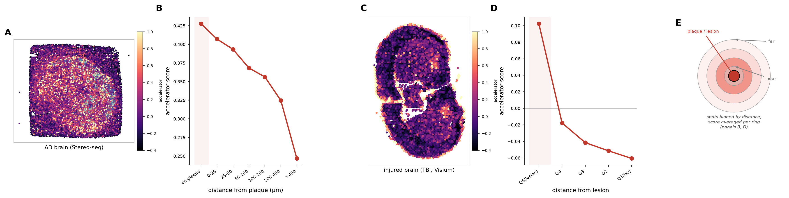

# TBI installs what AD inherits: a shared microglial resolution-failure axis
### A single blow to the head may switch on the same brain-inflammation circuit that Alzheimer's risk genes leave permanently primed

*Built with Claude — Life Sciences Hackathon · Researcher Track submission*

---

## Why this matters

Alzheimer's disease is already living inside millions of families. It takes memories, then independence, then the person, over years — and there is still no treatment that changes that course. The cost, in caregiving hours and grief and strain on health systems, is enormous and largely invisible until it happens to your own family.

Who gets Alzheimer's is not decided by genes alone. Genes set part of the risk; the life a brain has lived sets the rest. Among the environmental risks, head trauma stands out as one of the largest and most modifiable: a single severe blow, the repeated sub-concussive hits of a contact-sport career, the blast waves of a military deployment. Moderate-to-severe traumatic brain injury (TBI) roughly **doubles** a person's later risk of dementia. That number has been known for years. What has not been known is *why* — what actually happens inside the brain, at the level of genes and cells, that turns an injury from years ago into dementia today.

That missing mechanism is the reason this matters beyond any one disease. If a blow to the head and an inherited Alzheimer's risk variant turn out to converge on the *same* faulty circuit, then a single therapy aimed at that circuit could, in principle, help a retired athlete, a veteran of a blast injury, and a family carrying Alzheimer's risk genes — three groups who today have almost nothing in common in the clinic.

---

## The finding, in one sentence

**A brain injury switches on, environmentally, the same microglial inflammation program that Alzheimer's risk genes predispose a person to genetically — and in both cases, the braking system that should shut that program back down stays disengaged.**

Two quick definitions we'll use throughout:

- **Accelerator genes** — genes that ramp inflammation up. In microglia (the brain's resident immune cells) this includes *OPN/SPP1*, *TREM2*, *APOE*, the complement genes, and *TLR2*.
- **Brake / resolution genes** — genes that are supposed to shut inflammation back off once it has done its job: *TSG-6/TNFAIP6*, the *HAS* genes, *ANXA1*, *TGFβ*.

Both an injury (environment) and inherited common DNA variants (genetics) push the accelerator genes up. Neither pushes the brake genes up. Both signal through one shared receptor, **CD44**, where the accelerator's signaling molecule (SPP1/OPN) and the brake's signaling molecule (TSG-6) compete for the same docking site. A shared, brake-deficient circuit that converges on one receptor is exactly the shape of a therapeutic target — not just an association to note, but a mechanism to test.

**Figure 1 (the hook).** A single pipeline diagram: injury and inherited risk both feed into one accelerator module; the same genes rise in human AD tissue and in mouse injury tissue; the effect reproduces across species and across independent methods (shown as a forest plot, the standard way of stacking several studies' effect sizes on one axis to see if they agree); microglial DNA — just a sliver of the genome — carries 31% of all inherited AD risk. The figure closes on one line: *one axis, three independent lines of evidence.*

---

## Where the gene list comes from, and why it should be trusted

The accelerator/brake gene list was **not** built from the data we test it on. It was defined *first*, from established biology: the accelerator arm comes from the well-described "disease-associated microglia" (DAM) inflammation literature (SPP1, TREM2, APOE, complement, GPNMB); the brake arm comes from the TSG-6→CD44 anti-inflammatory pathway described in prior work. Only after fixing that list did we test it against public data. That order matters — it is what keeps a promising-looking gene list from being an artifact of the data it was "discovered" in.

Because any curated gene list invites the suspicion that we simply picked genes that would work, we ran two independent checks — the first (below) was planned before we touched the data; the second we added once the results looked interesting — plus we report one clear limitation up front:

- **The genes move together.** Across human AD microglia, the accelerator genes rise and fall together far more than expected — a co-movement score (average pairwise correlation) of 0.074, versus 0.013 for random gene sets matched for detectability. It beat 100% of those random sets. This is a real, coordinated program, not an arbitrary list. *(This is corroboration by a completely different statistical route than picking genes by hand.)*
- **The pattern re-emerges without being told the list.** We ran a pattern-finding method (non-negative matrix factorization, or NMF — an unsupervised technique that groups genes by how they naturally co-vary, without being told in advance which genes belong together) directly on the AD microglia data, with no accelerator/brake list fed in. It independently produced a factor matching our accelerator module (correlation r = 0.61), led by *APOE*, the *C1q* complement genes, *B2M*, and *SPP1*. The module reappears on its own.
- **The receptor hub.** The module's two signaling molecules, accelerator ligand **SPP1/OPN** and brake ligand **TSG-6/TNFAIP6** (which works together with hyaluronan, a sugar polymer TSG-6 helps organize), compete for the same docking receptor, **CD44**. CD44 also gates the *TLR2*/NF-κB accelerator switch. CD44 belongs in this story because of what it *does*, not because its own expression level moves dramatically.
- **The honest limitation.** In the single-nucleus data — a method that reads gene activity out of individual cell nuclei pulled from frozen brain tissue — the brake genes are barely visible at all: *TNFAIP6* and all three *HAS* genes are detected in under 1% of microglia; *IL10* in about 2%. So calling the brake "disengaged" is partly a real biological finding and partly a measurement gap. The fix is straightforward: bulk RNA sequencing (which reads a tissue sample's average gene activity, and is far more sensitive for rare transcripts) already shows CD44 rising as much as ~25-fold after a controlled brain injury in mice (PMID 25309501). We flag this as a next experiment, not something we can already claim.

**Figure 5 (the CD44 hub).** How two different brain cell types wire into this one receptor: microglia carrying the accelerator signal, astrocytes (the brain's other major support cell) carrying the brake signal, both converging on CD44. Under injury, the astrocyte side of that wiring fails to hold: TSG-6, the brake gene, drops even as everything else in the circuit rises. That asymmetry — one side firing, the other side silent — is what makes CD44 a concrete, lab-testable node for a future therapy.

---

## The evidence: two independent arms

### Arm 1 — Environmental: what an injury or AD actually does to microglia (recomputed here from public data)

We measured, directly, how much the accelerator program turns on in real tissue, using two public single-nucleus datasets. For each sample we averaged each cell's readings into one number per gene per sample, then compared AD or injury cases against controls — computed fresh during this event, not pulled from a prior published result.

- **Human AD** — the SEA-AD brain-bank dataset, 84 AD donors vs. 5 controls. The accelerator switches light up: *APOE* rises (Δ +0.61), *TLR2* rises (+0.72), and downstream accelerator genes *SPP1/OPN* (+1.26), *C3*, and the *C1q* complement genes all rise in AD microglia. The brake genes stay flat.
- **Mouse TBI** — the CEREBRI dataset, 26 injured mice vs. 10 controls. The *same* accelerator genes rise after physical injury: *APOE* (+0.88), *TNF* (+0.81), *LPL* (+0.75), *SPP1/OPN* (+0.89). An injury installs the exact program that AD genetics predisposes a person toward.
- **Convergence, gene by gene.** Plotting each accelerator gene's rise in AD tissue against how much inherited genetic risk sits on that gene separates two groups: genes that are **genetically anchored** — *APOE*, *TREM2*, *TNF*, each carrying three or more AD risk variants — and genes that are **environmentally installed** — *SPP1/OPN*, the complement genes, *TLR2* — which turn on with injury or disease but carry little inherited risk of their own. Neither group touches the brake arm. *(This is the integration moment: neither the genetics alone nor the expression data alone would show this split — only laying the two layers side by side does.)*

**Figure 4 (where and when).** Spatially, the accelerator program is not smeared evenly through the brain — it concentrates right where the damage is: around the amyloid plaque in AD tissue, and around the injury site in TBI tissue, on the same side of the brain as the lesion. In the injury timecourse, the program peaks about seven days after the injury.

*(A larger companion resource — a five-dataset cross-species atlas plus an independent proteomic dataset — exists as a separate project and is not part of this submission. Every number reported above was recomputed here, from public data, during the event.)*

### Arm 2 — Genetic: does inherited AD risk itself land on this same circuit?

Using the Bellenguez Alzheimer's genome-wide association study (GCST90027158 — a scan of common DNA differences across tens of thousands of people with and without AD), the Corces lab's microglial chromatin AI model (`corceslab/variantapp`, release C24), and a heritability-concentration test (S-LDSC — a statistical method that asks how much of a disease's total inherited risk is concentrated in one region of the genome, rather than spread evenly), we tested whether AD's genetics itself lands on this circuit.

| Layer | What we tested | What we found |
|---|---|---|
| **1 · Do AD variants sit in accelerator DNA switches?** | Overlap of AD risk variants with microglial accelerator enhancers (short DNA stretches that act as switches for nearby genes), checked against thousands of randomly matched control variants with similarly common frequency in the population | Accelerator switches show a 1.56-fold excess (P = 0.0022); not simply driven by the well-known *APOE* gene region (still P = 9.5×10⁻³ with it removed); brake switches show **no** excess at all |
| **2 · Do those variants actually break the switch?** | An AI model of DNA openness scored every variant in these switches for how much it would change the switch's state | AD-linked accelerator variants disrupt microglial chromatin more than non-AD variants (P = 0.005); the single strongest hit, rs3800342, sits in a DNA switch for *TREM2* and clears the strict genome-wide significance bar for AD risk (P = 9.3×10⁻¹²) |
| **3 · How much of AD's total inherited risk sits here?** | Heritability-concentration test, controlling for known genomic background factors | Microglial DNA switches — just 1.5% of the genome — carry **31%** of all AD inherited risk, a 21-fold concentration (P = 1.1×10⁻⁵); within that signal, the direction is accelerator-positive and brake-negative |

*Plain-English summary: line 1 asks "do AD variants sit near the right genes"; line 2 asks "do those variants actually change how open the DNA switch is"; line 3 asks "how much of AD's total inherited risk is concentrated here." All three point the same direction.*

**Putting the two arms together:** the upstream switches — *TREM2*, *APOE*, *TNF* — carry the inherited risk; the downstream effector genes — *SPP1/OPN*, the complement genes, *TLR2* — are the ones an injury or disease state installs. The genetics perturbs the switch. The injury drives the downstream genes. Both land on one program. *(This corroborates the association through a completely independent data type — DNA sequence and inherited variation — rather than gene activity.)*

---

## From convergence to mechanism: which way does it run, and how would you flip it?

Showing that TBI and AD hit the same program is convergence. The next questions are harder: which direction does causation run, where exactly does inherited risk act, and what would it take to intervene? We used only public data and public models to push on these.

### Direction: are the downstream genes inherited, or installed?

We tested whether AD's genetic risk and each gene's own local DNA regulation "share the same causal DNA letter" — the technical term for this is colocalization, but in plain terms it just means asking whether one specific DNA change is responsible for *both* signals at once, rather than two different nearby changes each doing their own thing.

| Test | Data used | Result |
|---|---|---|
| **Gene-activity test in myeloid cells** | DNA changes that alter how much a gene is switched on (measured in macrophages and monocytes, immune cells related to microglia; signals as strong as P = 3×10⁻²⁷) | No shared causal letter with AD risk (highest probability score, PP4 = 0.02) — this rules out the objection that using whole-brain tissue diluted a real signal |
| **Chromatin-openness test in real microglia** | DNA changes that alter how open a gene's switch is, measured directly in human microglia (150 samples) | A genome-wide-significant switch-openness signal at *SPP1* (P = 1.5×10⁻¹²), but it does **not** share a causal letter with AD risk (PP4 = 0.06); at *CTSB*, both signals are real but the score (PP3 = 0.97) says they are driven by *different* DNA letters — real association without a shared cause |
| **Three-way check** | Three separate pairwise tests — switch-openness, gene-activity, and AD risk — each asking the same causal-letter question, using two independent microglial data types | Switch-openness and gene-activity share a modest amount of causal overlap at *C1QA* (PP4 = 0.18); but neither one shares a causal letter with AD risk (highest score 0.06) |

The chromatin control of the downstream accelerator genes is real biology — but it runs **independently of inherited AD risk**. Risk enters through *APOE* and *TREM2* and the broader switch landscape, not through the downstream genes themselves. That is the logic of a two-hit model: the injury (or disease process) installs the downstream genes; the inherited variants set how high the threshold is before that installation becomes damaging.

**Figure 3 (trigger vs. threshold).** A four-step diagram — a DNA variant, whether it opens a nearby switch, whether that switch loops over to contact its gene, and whether the gene's activity actually changes — mapped for each accelerator gene. As a positive control, when we run this same pipeline on the two genes everyone already agrees are AD genes, only *APOE* and *TREM2* clear the strict genome-wide significance bar; the downstream effector genes do not. That asymmetry — a couple of genes carrying nearly all the measurable inherited risk, the rest carrying almost none — is the risk asymmetry this figure shows.

### The switches: which master-control proteins run the circuit

Master-control proteins are proteins that physically bind DNA and switch nearby genes on or off. We used the chromatin AI model to digitally delete the DNA sequence each master-control protein recognizes, across all 754 DNA switches in this circuit, and asked how much each deletion closed the switch down.

Two clearly different roles emerged:

- **Identity proteins.** Deleting the recognition site for **SPI1/PU.1** closes down switches across *both* the accelerator and brake arms — and does so in a dose-dependent way: the stronger the SPI1 recognition site, the bigger the closure (correlation ρ = −0.28, P = 9×10⁻¹⁵). **CEBPB** sits alongside it, doing the same broad job. These are not "on/off" proteins for inflammation specifically — they are the proteins a cell needs simply *to be a microglia at all*. CEBPB has its own independent AD connection: it drives an enzyme, δ-secretase, that cleaves APP and tau (the two proteins central to AD pathology), and CEBPB is itself degraded by a protein called COP1 — making it a therapeutic node in its own right.
- **The accelerator/brake switch itself.** Deleting the recognition site for **NF-κB** — the master-control protein that switches the accelerator ON — closes accelerator switches specifically (P = 1.9×10⁻⁵). Deleting the recognition site for **MEF2** does *not* close the brake switches. In other words: **MEF2C is a repressor that holds the accelerator OFF; it is not a general identity protein.** Losing MEF2C releases the brake; it does not, by itself, build the accelerator.

**Independent convergence:** our chromatin-model analysis names SPI1 as the single most important identity protein in this circuit. Separately, a 2022 study (Kosoy et al.) used a completely different method — mapping the network of master-control proteins across microglial genes directly from gene-activity data — and, independently, named SPI1 the master identity protein controlling both microglial gene control overall and AD risk specifically. Two unrelated methods land on the same protein. *(A clean case of corroboration by an entirely different analytical route.)*

**Figure 2 (the switch).** A diagram of the DNA switch itself, oriented to show where each master-control protein binds relative to the gene it controls: NF-κB switching the accelerator ON, MEF2C holding it OFF, and SPI1/CEBPB as the identity proteins the cell needs simply to exist as a microglia. The dose-response panel shows SPI1 by name: the stronger its binding site, the more the switch closes when that site is deleted.

### Ordering the transition in time

We ordered individual AD microglia along a line from healthy to inflamed (a method sometimes called diffusion pseudotime, which we describe here simply as ordering cells from healthy to inflamed based on how similar their overall gene activity is). Along that line, the transition into the accelerator state tracks closely with the *loss* of MEF2C and P2RY12 identity (correlation ρ = −0.49 between position on that line and a homeostatic-identity score), alongside a coordinated rise in NF-κB and SPI1 activity. People carrying the AD risk variant *APOE*-ε4 who nonetheless stayed cognitively resilient sit earlier along that healthy-to-inflamed line (a directional but not yet conclusive result, P = 0.05 — an incoming ~100-sample cohort should settle this).

---

## What is genuinely new here

To keep the claims honest, we draw a clear line between what corroborates prior work and what this submission adds:

**Already known, and reproduced here as a validity check:** AD's inherited risk concentrates in microglial DNA switches (shown previously by Gjoneska 2015, Nott 2019, Corces 2020). Our 21-fold heritability-concentration result recomputes that finding from the Bellenguez and Corces data — it anchors our pipeline in prior work, it is not itself a discovery. *TREM2*, *APOE*, and the disease-associated-microglia state are all well characterized already.

**New in this submission:**

1. Recognizing **CD44 as the integrating receptor** where the accelerator ligand SPP1/OPN and the brake ligand TSG-6 compete — a single druggable node that also gates the NF-κB/TLR2 switch.
2. Turning the accelerator-vs-brake split into a **genetic test**: AD risk loads onto the pro-inflammatory arm and specifically avoids the pro-resolving arm — a negative-control comparison nobody had run before.
3. A **quantified, gene-by-gene map** of environmental installation (human AD, mouse TBI) against genetic risk load (GWAS plus chromatin AI model), on one shared axis.
4. The **measurement finding**: the brake arm is essentially invisible in single-nucleus data and requires bulk RNA sequencing to see properly (where CD44 rises up to ~25-fold after injury, PMID 25309501) — reframing "the brake fails" as partly a real biological finding and partly a fixable measurement gap.
5. The **direction result**: three separate causal-letter tests across three molecular layers (myeloid gene-activity data, primary-microglia switch-openness data, and a three-way cross-check) show the downstream accelerator genes are genetically regulated but genetically *independent* of AD risk — installed by the trigger, not by inheritance.
6. The **two-tier master-control-protein architecture**: SPI1/CEBPB as broad identity proteins versus NF-κB/MEF2C as the arm-specific switch, with direct evidence that MEF2C acts as a repressor rather than a general identity protein.
7. The **independent SPI1 convergence** — our chromatin-model result and Kosoy's network-based result name the same master identity protein by two unrelated methods.

---

## Data, code, and honesty about statistics

- **All data are public.** Every accession and URL is listed in `DATA_PROVENANCE.md`: Bellenguez GWAS (GCST90027158), Corces microglial chromatin model (`corceslab/variantapp`, release C24), Zenodo record 10515792, the SEA-AD single-nucleus dataset, and the CEREBRI mouse TBI dataset (GSE269748).
- **MIT-licensed**, with a reproducible notebook, scripts, and three documented software environments. The chromatin-scoring pipeline reconstructs the Corces model from scratch and is checked against the original authors' own scores (correlation r = 0.986 on log-fold-change). The heritability-concentration pipeline is a from-scratch Python 3 rebuild of the standard `bulik/ldsc` tool, with every fix documented.
- **We report statistics honestly.** The genome-wide concentration of AD risk in microglial DNA switches is strongly significant (P = 1.1×10⁻⁵). The much smaller within-circuit comparisons (accelerator vs. brake direction) are reported by the *direction* of their effect with confidence intervals shown — none of them individually reach significance on their own, and we say so rather than overstating them.
- **In-silico perturbation caveat.** All of the master-control-protein deletion results above come from a computational model predicting what *would* happen — they are predictions, not results from an actual laboratory experiment, and we treat them accordingly below.

---

## What this unlocks: a ranked, testable path forward

This is a therapeutic *rationale* with an identified circuit behind it — not yet a validated drug target. Everything computational here needs a bench test before it means anything clinically. In order of priority:

1. **The two-hit clinical test.** Does prior TBI combined with *APOE* genotype interact to raise dementia risk more than either alone? This is the epidemiological question our molecular model directly predicts, and it is the single highest-priority next step. We provide a standalone analysis plan (`results/adni_dod_sidequest.md`) designed to run under the separate, controlled-access data governance that this kind of clinical data requires — deliberately kept outside this public project.
2. **Measure the brake where it can actually be seen.** Re-run the "genes move together" test above on bulk RNA sequencing data for *TNFAIP6*, the *HAS* genes, *HYAL*, and *CD44* — the part of the circuit single-nucleus sequencing cannot resolve. Existing bulk injury timecourse data (e.g., PMID 25309501) is the immediate resource for this.
3. **Bench validation of the perturbation predictions.** Reducing SPI1/CEBPB activity, blocking NF-κB, releasing MEF2C repression, and blocking the SPP1→CD44 interaction are now specific, ranked, and falsifiable predictions — ready for knockdown experiments in microglial cell models, delivered through microglia-targeted viral or lipid-nanoparticle vectors. One relevant prior result: deleting *SPP1/OPN* in a mouse AD model (5xFAD) reduces amyloid plaque burden (PNAS 2023, doi 10.1073/pnas.2218915120).
4. **The incoming cohort.** A new dataset of roughly 100 samples across six brain regions (AD, Lewy body dementia, and control donors, annotated for *APOE* genotype) will move the resilience/*APOE* timing result above from directional (currently P ≈ 0.05, on a small 9-vs-16-sample comparison) to conclusive.

---

*Team ≤ 2 · non-confidential submission · public data only · analysis performed during the event.*