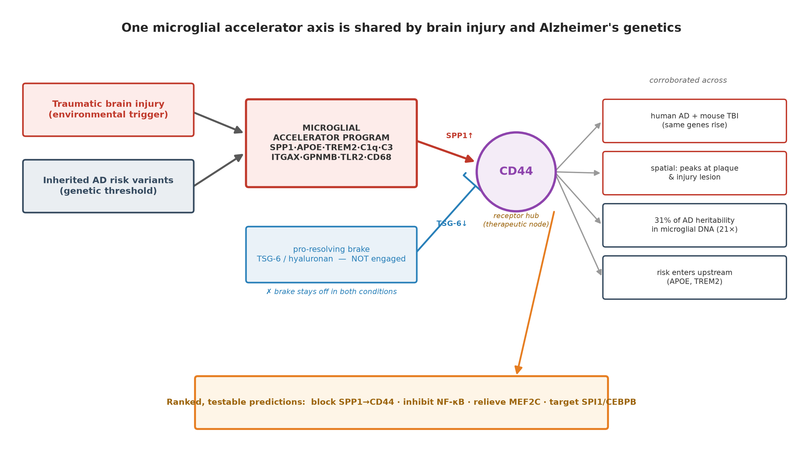
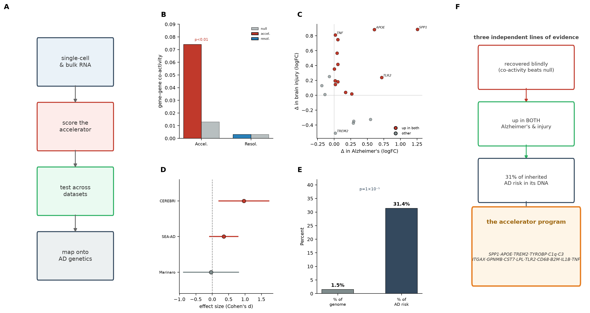
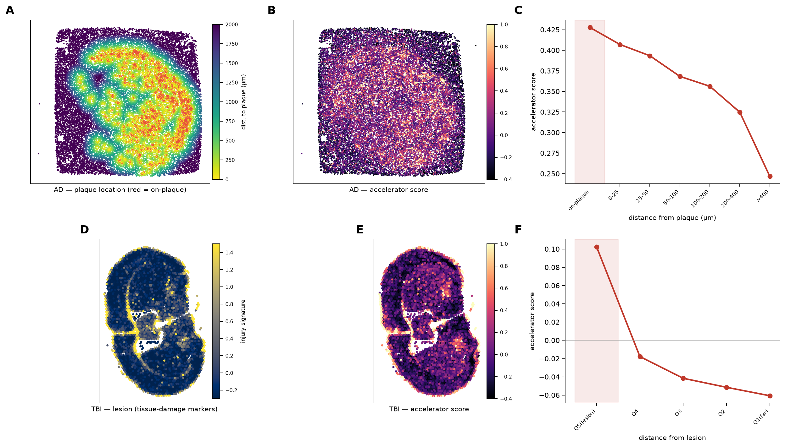
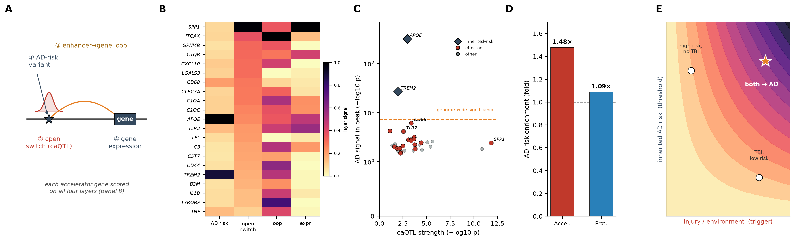
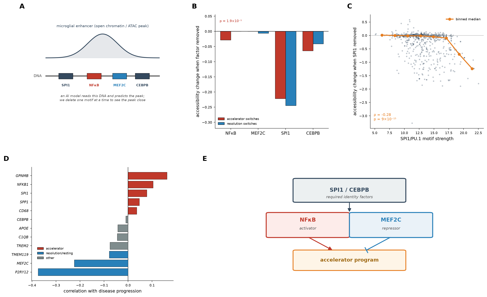
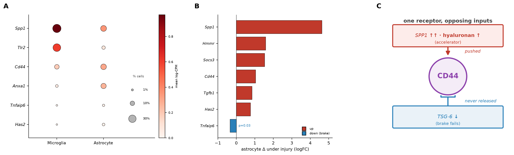
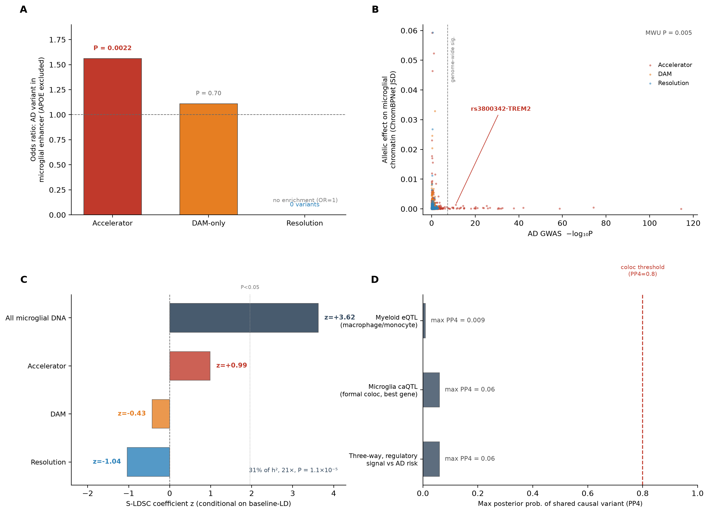
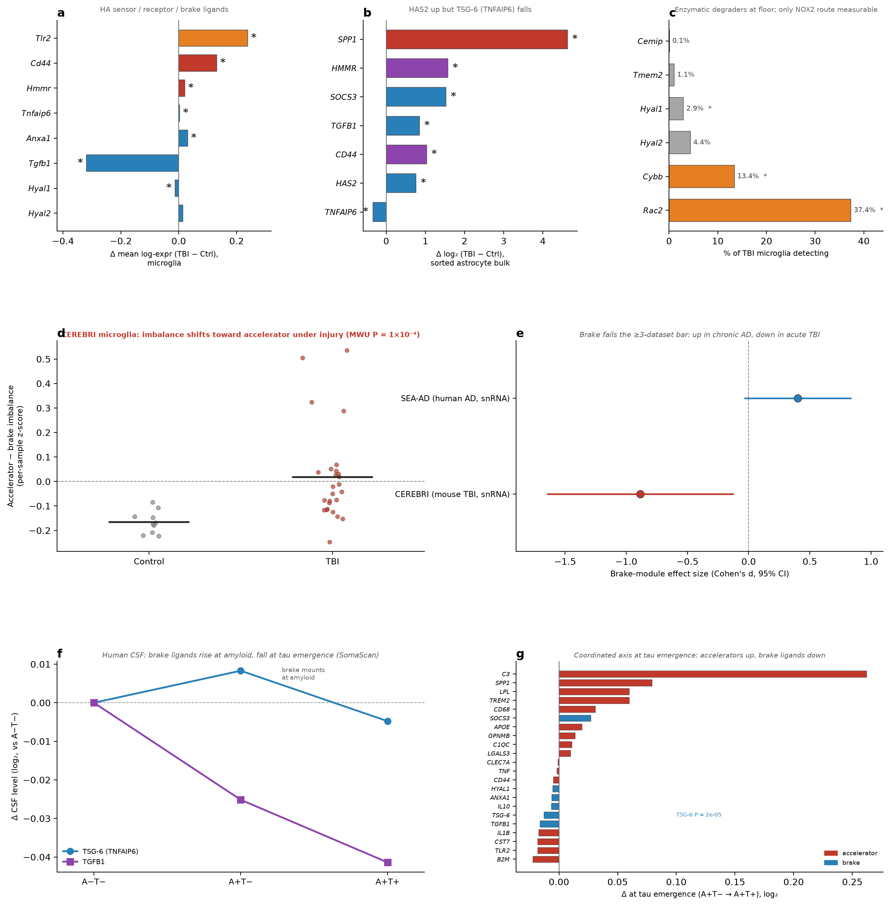
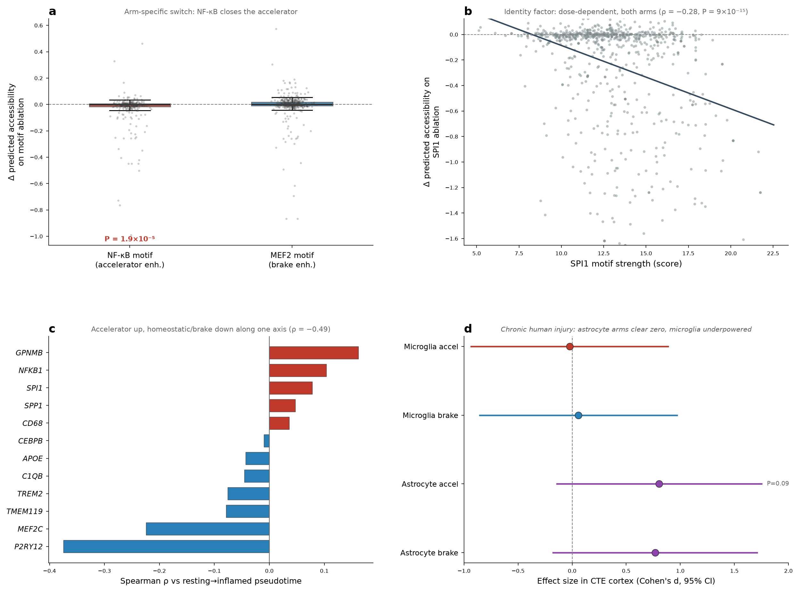

# A shared microglial resolution-failure axis links brain injury to Alzheimer's disease

**Mickey Pentecost, PhD**

*Built with Claude — Life Sciences Hackathon · Researcher Track submission*

---

## Abstract

Traumatic brain injury is among the strongest environmental risk factors for Alzheimer's disease, yet how a discrete physical injury and a lifetime of inherited genetic risk arrive at the same disease remains unclear. Here we ask whether the two act on a shared microglial substrate, and identify a single inflammatory program on which they converge. We defined a pro-inflammatory "accelerator" module and a pro-resolving "brake" module from established biology, in advance of any analysis, and found that the accelerator behaves as a genuinely coordinated program in human Alzheimer's microglia and is recovered without supervision, whereas the brake is not coherently engaged. Reanalysis of public single-nucleus data showed that the same accelerator genes are induced in both human Alzheimer's and mouse post-injury microglia, and spatial data placed the program directly at amyloid plaques and at the injury lesion. Partitioned-heritability analysis localized much of the common-variant Alzheimer's heritability to microglial regulatory DNA, loading specifically onto the accelerator arm while avoiding the brake. Colocalization across three molecular layers indicated that inherited risk enters upstream, through the established genes *APOE* and *TREM2*, rather than through the downstream effector genes, which are instead installed by the injury or disease state — the molecular form of a two-hit model. Finally, both arms are read out at one receptor, CD44, where the accelerator ligand osteopontin and the pro-resolving ligand TSG-6 compete. These results define a shared, brake-deficient microglial axis and nominate CD44 and its upstream regulators as testable nodes for intervention across injury- and genetically-driven dementia.

**Graphical summary.** A physical brain injury and inherited AD risk converge on one microglial accelerator program; the pro-resolving brake (TSG-6/hyaluronan) is not engaged; both arms meet at the receptor CD44. The convergence is corroborated across expression, space, and heritability, and it yields ranked, testable therapeutic predictions.

---

## Results

Genome-wide association studies have established that the common-variant genetic risk for Alzheimer's disease is concentrated in genes expressed by microglia, the brain's resident macrophages, and single-nucleus studies have resolved the pro-inflammatory disease-associated microglial states into which these cells transition during disease1,3. In parallel, epidemiology has repeatedly identified traumatic brain injury (TBI) as one of the strongest modifiable risk factors for later dementia, and recent work has extended this to the repetitive head impacts sustained in contact sport2. These two literatures have developed largely separately. Whether an acute injury and inherited risk act on the same microglial machinery — and if so, where in that machinery each one enters — has not been resolved, in part because injury and disease datasets are generated and analysed in isolation, and in part because a shared response is more naturally described at the level of a coordinated gene program than of any single marker gene.

We therefore framed the question around two opposing gene modules rather than individual genes. The accelerator module collects the canonical disease-associated microglia and pro-inflammatory genes (*SPP1*/osteopontin, *TREM2*, *APOE*, *C1QA/B/C*, *C3*, *ITGAX*, *GPNMB*, *CST7*, *LPL*, *TLR2*, *CD68*, *TYROBP*, *IL1B*, *TNF* and related genes). The brake, or pro-resolving, module collects the TSG-6/CD44 anti-inflammatory pathway together with the hyaluronan-synthesis and -turnover machinery (*TNFAIP6*, *HAS1/2/3*, *HMMR*, *ANXA1*, *TGFB1*, *SOCS3*, *IL10*, *HYAL1/2*). Both lists were fixed from prior literature before any analysis of the datasets reported here, so that a coordinated signal, if found, could not be an artifact of genes selected for their behaviour in the test data. We then interrogated these modules with nine analyses spanning two species, four assay types and both common-variant and regulatory genetics (Table 1). The design is deliberately triangulating: the accelerator arm is the test annotation and the brake arm serves as a pre-specified negative contrast, so that a signal specific to one arm cannot be explained by a generic property of microglial genes. Across all nine analyses, injury and inherited risk converge on the accelerator arm, the brake arm is not engaged, and the two are integrated at a single receptor.

**Table 1 | Convergent evidence for a shared accelerator axis across nine analyses.**

| Layer | Data source | Test | Key result |
|---|---|---|---|
| Coordination | SEA-AD human AD snRNA-seq | Module coherence vs matched null | Co-activity 0.074 vs 0.013; beats 100% of nulls |
| Unsupervised recovery | SEA-AD human AD snRNA-seq | NMF without module labels | Accelerator factor recovered, r = 0.61 |
| Induction (human) | SEA-AD (84 AD / 5 control) | Pseudobulk case–control | Accelerator up (*SPP1* +1.26, *TLR2* +0.72); brake flat |
| Induction (mouse) | CEREBRI TBI (26 / 10) | Pseudobulk injury–control | Same genes up (*APOE* +0.88, *SPP1* +0.89) |
| Space | AD Stereo-seq; TBI Visium | Distance-to-pathology gradient | Peaks at plaque and lesion (injury ρ = 0.65) |
| Chronic injury (human) | CTE / RHI snRNA-seq (GSE261807) | Donor-level module score | Directional; astrocyte accelerator *d* = 0.81 (underpowered) |
| Chronic injury (human) | CTE brain proteomics, McKee I–IV (Emory/BU) | Severity dose–response | Accelerator rises with stage (ρ = 0.38, P = 0.002); *CD44* up at stage IV |
| Heritability | Bellenguez GWAS + Corces chromatin | S-LDSC + variant-effect model | 31% of AD heritability in microglial DNA (21×, P = 1.1×10⁻⁵), accelerator-specific |
| Causal direction | Myeloid eQTL, microglia caQTL, GWAS | Three-layer colocalization | Effectors regulated but AD-independent; risk enters at *APOE*/*TREM2* |
| Regulation | Corces chromatin model | *In silico* motif ablation | NF-κB activates, MEF2C represses; SPI1/CEBPB are identity factors |

### An *a priori* module behaves as a coordinated program

Because a curated gene list invites the concern that the genes were chosen for their fit, we first asked whether the accelerator module behaves as a genuine coordinated program in human AD microglia, using two orthogonal, list-agnostic tests. First, the accelerator genes covary substantially more than expected: their mean pairwise co-activity is 0.074, against 0.013 for detectability-matched random gene sets, exceeding 100% of those null sets. Second, applying non-negative matrix factorization — an unsupervised decomposition that groups genes by natural covariation without being given the module definition — recovered a factor matching the accelerator module (r = 0.61), led by *APOE*, the *C1q* genes, *B2M* and *SPP1*. The module therefore re-emerges from the data on its own (Fig. 1).

One caveat is intrinsic to the data type. In single-nucleus RNA-sequencing the brake genes are near the detection floor — *TNFAIP6* and all three *HAS* genes are detected in fewer than 1% of microglia, *IL10* in approximately 2% — so the apparent absence of a resolution response is in part a sensitivity limitation rather than a purely biological one. Bulk RNA-sequencing, which is far more sensitive for low-abundance transcripts, resolves these genes and shows *CD44* rising up to ~25-fold after controlled cortical injury in mice4; we therefore treat "the brake is disengaged" as a partly measurement-limited statement and identify bulk sequencing as the appropriate assay (Fig. 5).

### The accelerator program is installed by both injury and disease

We quantified the accelerator response directly in tissue by recomputing per-sample pseudobulk expression from two public single-nucleus datasets during this work, rather than importing any prior differential-expression result. In human AD (SEA-AD; 84 AD donors, 5 controls), accelerator genes rose coordinately in microglia — *APOE* (Δ +0.61), *TLR2* (+0.72), *SPP1* (+1.26), *C3* and the *C1q* genes — while the brake genes remained flat. In mouse TBI (CEREBRI; 26 injured, 10 controls), the same genes rose after physical injury — *APOE* (+0.88), *TNF* (+0.81), *LPL* (+0.75), *SPP1* (+0.89). An injury thus installs, environmentally, the program that AD genetics predisposes toward.

Plotting each gene's induction in AD tissue against its inherited genetic-risk load separated two classes: genetically anchored genes (*APOE*, *TREM2*, *TNF*; each carrying three or more AD risk variants) and environmentally installed genes (*SPP1*, complement, *TLR2*; induced by injury or disease but carrying little inherited risk). Neither class involved the brake arm. This separation is visible only when the genetic and expression layers are examined jointly (Fig. 1).

Spatially, the program is not distributed uniformly. In AD Stereo-seq tissue the accelerator score is highest on and adjacent to amyloid plaques and declines monotonically with distance; in TBI Visium tissue it is highest in the region carrying a tissue-damage signature (Spearman ρ = 0.65 between the accelerator score and the injury signature) and falls off away from it (Fig. 2). An independent human cohort of repetitive head impact and low-stage chronic traumatic encephalopathy (GSE2618072; 8 control, 9 repetitive-head-impact, 11 CTE donors), which we scored during this work, was directionally consistent — the accelerator program was elevated most clearly in astrocytes (Cohen's *d* = 0.81, 95% CI 0.05–1.76 for CTE), and the fraction of *SPP1*-positive microglia increased with cumulative exposure (19.7% → 23.7% → 26.2%) — but this cohort is underpowered (n = 8/9/11) and the microglial effect did not reach significance; we report it as supporting, not confirmatory (Supplementary Fig. 3d). A second, independent human CTE cohort — deep-tissue brain proteomics staged by neuropathological severity (Emory/Boston University brain bank, 43 CTE across McKee stages I–IV and 23 controls17), which we reanalysed here — showed the accelerator module rising monotonically with disease stage (Spearman ρ = 0.38, P = 0.002), reaching Cohen's *d* = 0.86 (95% CI 0.32–1.53) at the most severe stage; the *CD44* hub itself was higher at stage IV than in controls (P = 0.012). Because this is mass-spectrometry proteomics the brake ligands remain below the detection floor, so the cohort tests the accelerator arm only, and the dose–response is carried by *LGALS3*, *ITGAX*, the *C1q* genes and *CD44* rather than *SPP1* (Fig. 1d, Supplementary Fig. 3e).

**Figure 1 | A single microglial accelerator axis is shared by injury and inherited risk.** **a**, Analysis pipeline: single-cell and bulk expression are scored for the accelerator module, tested across datasets and mapped onto AD genetics. **b**, Module coherence: accelerator gene co-activity (0.074) versus detectability-matched null (0.013), P < 0.01. **c**, Gene-by-gene induction in human AD against mouse TBI, with genes up in both highlighted. **d**, Cross-dataset reproducibility of the accelerator effect (forest plot of effect sizes). **e**, Partitioned heritability: microglial regulatory DNA (1.5% of the genome) carries 31% of AD heritability (P = 1×10⁻⁵). **f**, Synthesis: three independent lines of evidence — blind recovery, induction in both conditions, and concentration of inherited risk — define the 15-gene accelerator program.

**Figure 2 | The program concentrates at the pathology in space.** **a**, AD Stereo-seq plaque location (red = on-plaque, colour = distance to plaque). **b**, Accelerator score in the same coordinate frame. **c**, Accelerator score by distance from plaque. **d**, TBI Visium injury signature (the lesion). **e**, Accelerator score in the same coordinate frame. **f**, Accelerator score by distance from the lesion. Each row reads pathology location → accelerator score → distance gradient; because **b**/**e** share the coordinate frame of **a**/**d**, the correspondence between the accelerator program and the pathology can be read directly.

### Inherited AD risk loads onto the accelerator arm

We next asked whether AD's common-variant genetics acts on the same circuit, integrating the Bellenguez AD genome-wide association study5, a microglial chromatin model of variant effect (Corces C243,6), and stratified linkage-disequilibrium score regression (S-LDSC)7 (Fig. 3). Because the published variant-effect scores do not cover all axis variants, we reconstructed the microglial model from its released weights and confirmed fidelity against the authors' own scores before applying it (log-fold-change Pearson r = 0.986), so the chromatin predictions used here are our own computation rather than a lookup. We then addressed three questions in sequence.

First, do AD variants occupy accelerator regulatory elements? Accelerator enhancers showed a 1.56-fold excess of genome-wide-significant AD variants relative to allele-frequency-matched control variants (permutation P = 0.0022), and the excess persisted with the *APOE* region removed (P = 9.5×10⁻³), showing it is not an artifact of that single strong locus; brake enhancers showed no excess (odds ratio ≈ 0). Second, do those variants alter regulatory activity rather than merely sit nearby? Scoring every variant through the reconstructed chromatin model, AD-associated accelerator variants disrupted predicted microglial accessibility more than non-AD variants in the same enhancers (Mann–Whitney P = 0.005); the strongest single effect, rs3800342, falls in a *TREM2* enhancer and independently clears genome-wide significance for AD association (P = 9.3×10⁻¹²). Third, how much of the total inherited risk lies here? Partitioned heritability placed 31% of common-variant AD heritability within microglial regulatory DNA — only 1.5% of the genome, a 21-fold enrichment (P = 1.1×10⁻⁵) with a positive conditional coefficient after adjustment for the full baseline model, confirming the signal is specific to this annotation rather than inherited from broader genomic features. Partitioning that signal by arm, the accelerator annotation carried a positive coefficient and the brake annotation a negative one. The concentration of AD heritability in microglial regulatory DNA is itself established3,8,9; what is new is its resolution into an arm-specific pattern — loading onto the pro-inflammatory accelerator and avoiding the pro-resolving brake (Supplementary Fig. 1a–c).

### Risk enters upstream, not through the effector genes

Convergence in space and expression does not establish direction: the effector genes could be induced by the disease process, or they could themselves carry the inherited risk. We distinguished these by testing colocalization — whether a single shared causal variant underlies both an AD-risk signal and a local regulatory signal at a gene — across three molecular layers, each closing a specific loophole in the previous one (Fig. 3). The first layer addressed a standard objection to null colocalization results, that whole-brain tissue dilutes a microglia-specific signal: using myeloid *cis*-expression QTLs from macrophages and monocytes (cell types related to microglia, with regulatory signals as strong as P = 3×10⁻²⁷), no accelerator effector gene colocalized with AD risk (maximum posterior probability of a shared variant PP4 = 0.009). The second layer moved to the most proximal possible data — chromatin-accessibility QTLs measured directly in primary human microglia: a genome-wide-significant accessibility signal at *SPP1* itself (P = 1.5×10⁻¹²) still did not colocalize with AD risk (PP4 = 0.06), and at *CTSB* both an accessibility and an AD signal were present but were formally attributed to distinct variants (PP3 = 0.97), the pattern of a real association without a shared cause. The third layer tested all three signals jointly and found only modest accessibility–expression sharing at *C1QA* (PP4 = 0.18) with no sharing of either against AD risk (maximum 0.06). The consistent result across all three layers is that the downstream effector genes are under genuine, measurable regulatory control that is nonetheless independent of inherited AD risk. This is the molecular signature of a two-hit architecture: the injury or disease state installs the effector genes, while inherited variants at the upstream regulators *APOE* and *TREM2* set the threshold at which that installation tips into pathology. Trigger and threshold are separable, and they enter the circuit at different points (Supplementary Fig. 1d).

**Figure 3 | Inherited risk enters upstream of the effector genes.** **a**, Locus diagram: variant → enhancer → looping → gene activity. **b**, Four-layer heatmap across accelerator genes. **c**, Colocalization positive control: only *APOE* (−log₁₀P = 320) and *TREM2* (26.9) clear genome-wide significance; effector genes do not. **d**, Genetic asymmetry: accelerator 1.48× versus brake 1.09×. **e**, Trigger-versus-threshold synthesis.

### A two-tier regulatory grammar controls the circuit

To identify the regulators that operate the circuit, we used the chromatin model to perform *in silico* motif ablation — deleting each transcription-factor recognition sequence across all 754 circuit enhancers and measuring the resulting loss of predicted accessibility (Fig. 4). Two roles emerged. SPI1/PU.1 ablation closed enhancers across both arms in a dose-dependent manner (the stronger the motif, the greater the closure; ρ = −0.28, P = 9×10⁻¹⁵), with CEBPB acting similarly — the behaviour expected of lineage-identity factors required for microglial state as such rather than for inflammation specifically. By contrast, NF-κB ablation closed accelerator enhancers specifically (P = 1.9×10⁻⁵), whereas MEF2 ablation did not close brake enhancers, indicating that MEF2C acts as a repressor holding the accelerator off rather than as a general identity factor. Ordering AD microglia from homeostatic to inflamed by diffusion pseudotime, the accelerator transition tracked loss of MEF2C and P2RY12 identity (ρ = −0.49 with a homeostatic-identity score) alongside rising NF-κB and SPI1 activity; *APOE*-ε4 carriers who remained cognitively resilient sat earlier along this trajectory (a directional result, P = 0.05, in a 9-versus-16-donor comparison). The identity role of SPI1 was independently corroborated: a network-based analysis of the microglial regulome10, using a method unrelated to ours, also named SPI1 the master regulator of both microglial gene regulation and AD risk. CEBPB additionally has a direct disease connection, driving δ-secretase cleavage of APP and tau and being turned over by COP1, which makes it a therapeutic node in its own right (Supplementary Fig. 3a–c).

**Figure 4 | A two-tier regulatory grammar operates the circuit.** **a**, Enhancer diagram orienting transcription-factor binding relative to the target gene. **b**, NF-κB ablation closes accelerator enhancers specifically (Δ = −0.029, P = 1.9×10⁻⁵). **c**, MEF2 ablation and the arm-specific comparison. **d**, SPI1 dose–response: stronger motif, greater closure (ρ = −0.28, P = 9×10⁻¹⁵). **e**, Roles summarized: NF-κB activates and MEF2C represses the accelerator; SPI1/CEBPB are lineage-identity factors.

### Convergence on CD44

The two arms are linked at a single receptor. The accelerator ligand SPP1/osteopontin and the brake ligand TSG-6, working with hyaluronan, compete at CD44, which additionally gates the TLR2/NF-κB accelerator switch (Fig. 5). In sorted-cell injury data the astrocytic side of this circuit amplifies the accelerator inputs — SPP1 (+4.6), CD44 (+1.0), the hyaluronan synthase *HAS2* (+0.8) and the motility receptor *HMMR* (+1.6) all rise — while the one unambiguous brake ligand, TSG-6, falls (−0.34, P = 0.03). CD44 is therefore not a co-expression member of the module but its functional integration point: the receptor at which an engaged accelerator and a disengaged brake are read out together.

The elevation of CD44 itself is one of the most consistent observations in the study, reproducing across four independent modalities and both species (Fig. 5c). In sorted astrocytes it rises with injury (+1.0 log₂, P = 0.02); in an independent reanalysis of deep human AD brain proteomics (279 AD, 46 control) the CD44 protein is higher in disease (+0.26 log₂, P < 0.001); in a mouse amyloidome it is enriched in the laser-captured plaque microenvironment relative to adjacent non-plaque tissue (+0.72 log₂); and in single-nucleus microglia it is induced under injury (+0.13, P < 0.001). Published bulk work reports CD44 rising up to ~25-fold after controlled cortical injury4. The signal is strongest in cell-type-resolved or spatially resolved assays and is diluted in whole-tissue bulk, which is expected for a receptor concentrated in reactive glia at lesions and plaques. Two features of this convergence are worth noting for the resolution question. First, the brake enzymes that remodel hyaluronan (the *HAS* and *HYAL* genes) and the secreted brake ligand TSG-6 remain below the detection floor even in deep mass spectrometry, confirming that their near-absence in single-nucleus data is a property of low-abundance secreted and enzymatic proteins across assays, not an artifact of one platform. Second, recent independent proteomic surveys reach the same architecture from the opposite direction: cell type-resolved AD proteomics identifies astrocyte-derived signalling proteins that accumulate in microglia15, and single-plaque proteomics defines amyloid plaques as conserved multicellular hubs enriched for *APOE* and related factors16 — both consistent with an astrocyte-to-microglia relay read out at a shared receptor.

The nature of the hyaluronan signal at CD44 depends on its molecular weight: high-molecular-weight hyaluronan is anti-inflammatory, whereas the low-molecular-weight fragments generated when it is degraded act as damage-associated molecular patterns that engage TLR2/TLR4 and CD44 to amplify inflammation4. We cannot measure hyaluronan fragment size in transcriptomic or proteomic data, so we do not claim to observe fragmentation directly. Two independent facts nonetheless bear on it. First, the literature establishes that hyaluronan is degraded to pro-inflammatory fragments after brain injury — by both hyaluronidases and reactive oxygen species4 — while in Alzheimer's disease hyaluronan accumulates and associates with amyloid and tau pathology13, with the associated neuroinflammation attributed to the low-molecular-weight form. Second, in our own injured-microglia data the machinery that could drive this shift is engaged: the fragmenting route that is actually measurable in single-nucleus data — the NADPH-oxidase oxidative burst (*CYBB*/gp91^phox^ +0.17, P < 10⁻⁴; the assembly factor *RAC2* +0.13, P = 0.03) — is induced, the enzymatic degraders (*HYAL1/2*, *CEMIP*, *TMEM2*) sit at the detection floor across the board, the brake ligand *TGFB1* falls (−0.32, P = 0.003), and the low-molecular-weight sensor *TLR2* rises (Supplementary Fig. 2a–c). Because reactive oxygen species depolymerize hyaluronan non-enzymatically, this oxidative route does not depend on the low-abundance enzymes we cannot resolve, and it is a feature of acute inflammation — matching the acute injury setting in which we see the brake disengage. The parsimonious reading is a feed-forward loop that we infer rather than measure: an engaged accelerator mounts an oxidative burst whose products fragment the protective matrix into ligands that further engage the same accelerator receptor. Direct measurement of hyaluronan size in injured and Alzheimer's tissue is the experiment that would test it.

**Figure 5 | The two arms converge on CD44.** **a**, Detection of hub genes across microglia and astrocytes (dot colour, mean expression; dot size, fraction of cells detecting the gene). **b**, Astrocyte response under injury in sorted cells: accelerator inputs (SPP1, CD44, HAS2, HMMR) rise while the brake ligand TSG-6 falls (−0.34, P = 0.03; * P < 0.05). **c**, CD44 elevation reproduces across four independent modalities and both species — sorted-astrocyte bulk RNA under injury (+1.0 log₂), human AD brain protein (+0.26 log₂), the mouse plaque-microenvironment proteome (+0.72 log₂) and single-nucleus microglia under injury (+0.13); ** P < 0.01, * P < 0.05, † P < 0.1. **d**, Synthesis: SPP1 and hyaluronan push the CD44 receptor while TSG-6 fails to release it, nominating CD44 as a therapeutic node.

## Discussion

The central advance of this work is a concrete molecular form for the two-hit model of injury-associated dementia. Epidemiology has long held that a brain injury and inherited risk combine to produce Alzheimer's disease, but "combine" has had no mechanistic content. Our results specify it: the inherited risk and the environmental trigger act on the *same* microglial accelerator program but enter it at *different* points. The trigger — injury, or the AD disease process — installs the downstream effector genes (*SPP1*, the complement genes, *TLR2*), which we show are under genuine regulatory control yet carry essentially no common-variant AD risk across three colocalization layers. The threshold — how much accelerator activity a brain tolerates before it becomes pathogenic — is set upstream, at the regulators *APOE* and *TREM2*, where the heritability actually concentrates. Trigger and threshold are molecularly separable, and that separation reframes the injury-to-dementia link from an unexplained statistical association into a testable circuit with named, distinct components.

Around that central claim, three further elements are, to our knowledge, new. First, the accelerator-versus-brake distinction is turned into a genetic test, in which AD heritability loads onto the pro-inflammatory arm and specifically avoids the pro-resolving arm — a directional negative control, made possible by pre-specifying both modules, that has not previously been reported. Second, the regulatory analysis resolves the transcription-factor logic of the circuit into two tiers: broad lineage-identity factors (SPI1, CEBPB) that maintain the microglial state as such, and an arm-specific switch (NF-κB activating the accelerator, MEF2C repressing it) that determines whether the accelerator is engaged. Third, CD44 is identified as the physical integration point of the whole axis — the receptor at which an engaged accelerator ligand (SPP1) and a disengaged brake ligand (TSG-6) are read out together, which makes it the natural target for correcting the imbalance rather than either ligand alone. The convergence underpinning all of this rests on nine analyses across independent modalities (Table 1), so that no single data type or species carries the claim.

The accelerator is not a new microglial state, and we do not present it as one. At the gene level it overlaps substantially with the disease-associated microglia (DAM) and MGnD signatures described in mouse neurodegeneration: twelve of the twenty-one accelerator genes, including *APOE*, *TREM2*, *TYROBP*, *SPP1*, *ITGAX*, *GPNMB*, *CST7*, *CLEC7A* and *LPL*, are canonical DAM genes. The contribution is not the state but how it is used. First, the module is deliberately broader than DAM: the nine accelerator genes absent from DAM/MGnD are the NF-κB inflammatory (*IL1B*, *TNF*, *CXCL10*, *TLR2*) and complement (*C3*, *C1QA*, *C1QB*, *C1QC*) genes, together with the receptor *CD44*, so the accelerator fuses the phagocytic/lipid DAM program with the pro-inflammatory and complement arms that DAM, as originally defined, explicitly excludes. Second, and unlike any DAM description, it is paired with a pre-specified pro-resolving brake — none of whose genes appears in DAM or MGnD — so that resolution failure, not activation alone, becomes the object of study. Third, the accelerator is partitioned by heritability into an inherited threshold (*APOE*, *TREM2*, entering upstream) and an injury-installed trigger (the effectors), a decomposition that a single descriptive cell-state signature does not make. The novelty is therefore the cross-condition, two-armed, genetically-partitioned framework and its integration at CD44, not the identity of the genes.

The limitations are explicit. The near-invisibility of the brake genes in single-nucleus data means that its disengagement is partly a measurement gap, addressable by bulk sequencing; where the imbalance is measurable it shifts toward the accelerator in both diseases (Supplementary Fig. 2d), but the brake module itself does not reproduce uniformly — positive in chronic human AD and negative in acute mouse injury (Supplementary Fig. 2e) — a dataset-dependence we report rather than average away. The within-circuit directional comparisons (accelerator versus brake) are individually underpowered and are reported by effect direction with confidence intervals rather than as significant findings. The repetitive-head-impact/CTE cohort is directionally consistent but too small to be confirmatory. The transcription-factor ablation results are model-based predictions, not laboratory perturbations. Each of these defines a specific experiment rather than a claim already made.

### Toward intervention

Because the axis is defined at named nodes, it yields a ranked, falsifiable set of predictions rather than a general call for further study. We order them by directness and by how much independent support already exists.

The most immediate is epidemiological and follows directly from the trigger-versus-threshold result: prior TBI and *APOE* genotype should interact *super-additively* on dementia risk — the combination exceeding the sum of the two alone — because the injury supplies the trigger and the genotype sets the threshold. This is the sharpest test of the whole model, and it requires only existing longitudinal cohorts with injury history and genotype; because such data are controlled-access, we specify the analysis but deliberately keep it outside this public project.

At the mechanistic level, the axis nominates CD44 as the primary interventional node, because it is where an engaged accelerator ligand and a disengaged brake ligand are physically integrated. Because CD44 carries *both* signals, the prediction is not to block the receptor — which would disable the brake along with the accelerator — but to rebalance it toward resolution, and this yields two ranked, complementary interventions. First, and most directly implied by a resolution-failure model, restoring the missing brake ligand: supplying exogenous TSG-6 (with hyaluronan tone) to reinstate the pro-resolving signal that the data show never engages. Second, biasing the receptor in *trans*: an agent that occupies CD44 on the resolving side — cross-linking hyaluronan and outcompeting osteopontin for the receptor — so the hub is shifted away from the accelerator without ablating microglial identity. Both predictions already have partial independent support: deletion of *SPP1* in the 5xFAD model reduces amyloid burden11, and CD44 antagonism after TBI alters the neurogenic niche and behavioural outcome12, while increased hyaluronan and TSG-6 in human AD neuropathology13 and the meningeal response to injury and ageing14 place the brake arm in the relevant human and border-compartment tissue.

The regulatory tier gives the next, more selective targets. NF-κB and MEF2C are predicted to be the arm-specific levers — inhibiting NF-κB, or relieving MEF2C repression, should move the accelerator without disturbing microglial identity — whereas SPI1 and CEBPB, as lineage-identity factors, are predicted to be poor therapeutic targets despite being the strongest ablation hits, because closing them would compromise the cell itself. This is a concrete, testable ranking, not a target list: it predicts which perturbations should be selective and which should be toxic.

Two features of the data bound these claims and define the experiments that would settle them. The transcription-factor results are *in silico* motif-ablation predictions from a chromatin model, not laboratory perturbations, and the resolution/brake arm is near the detection floor in single-nucleus data, so its apparent disengagement is partly a measurement gap. Both point to the same next step — bench perturbation of the named nodes in microglial models, read out by bulk sequencing that can actually see the brake genes. Finally, an incoming ~100-sample, six-region cohort annotated for *APOE* genotype is expected to move the resilience result, currently directional (P = 0.05 in a 9-versus-16-donor comparison), to a conclusive test of whether homeostatic microglial tone protects *APOE*-ε4 carriers who resist dementia.

## Methods

**Single-nucleus expression modules.** Accelerator (21 genes) and brake (11 genes) modules were fixed *a priori* from published DAM and TSG-6/CD44 literature. Human AD microglia (SEA-AD, *SEAAD_MTG_glia_clean.h5ad*) and mouse TBI microglia (CEREBRI, GSE269748) were processed with per-sample quality control, library-size normalization to 10⁴ and log transformation. Module scores were computed per cell as the mean of per-gene *z*-scores and aggregated to per-sample pseudobulk means to avoid pseudoreplication; case-versus-control contrasts used the donor as the unit. Module coherence was the mean pairwise correlation of module genes, compared against 1,000 detectability-matched random gene sets. Non-negative matrix factorization (scikit-learn) was applied to the AD microglial matrix without module labels, and factors were matched to the module by correlation.

**Repetitive head impact / CTE.** GSE261807 filtered count matrices (28 donors) were loaded, quality-controlled (200–8,000 genes per nucleus, ≥500 counts), normalized and log-transformed. Coarse cell types were assigned by marker-mean *z*-score argmax; microglia and astrocytes were retained. Module scores were computed as above and tested at the donor level (Mann–Whitney and *t*-test; Cohen's *d* with 5,000-fold bootstrap 95% CIs).

**Spatial analysis.** AD Stereo-seq (with plaque segmentation) and TBI Visium (GSE319409) sections were scored with the accelerator module; spots were binned by distance to plaque or to the injury signature (a Gfap/Vim/C4b/Serpina3n/Lcn2/Timp1 composite) and scores averaged per bin.

**Genetics.** The Bellenguez GWAS (GCST90027158, GRCh38) was intersected with microglial enhancer annotations. Enrichment used frequency-matched control variants. Variant effects on chromatin were scored with a from-scratch reconstruction of the Corces C24 microglial model, validated against the authors' scores (log-fold-change r = 0.986). S-LDSC was run with a Python-3 reimplementation of *bulik/ldsc* against the 1000 Genomes Phase 3 baseline (annotations lifted to GRCh37; HapMap3 SNP set). Colocalization used pairwise approximate Bayes factors across myeloid *cis*-eQTLs, primary-microglia caQTLs and AD GWAS.

**Statistics.** Genome-wide heritability results are reported with exact P values. Within-circuit directional comparisons are reported by effect direction with confidence intervals and are explicitly identified as individually non-significant. Transcription-factor ablations are model predictions.

## Data availability

All primary data are public and enumerated in `DATA_PROVENANCE.md`: Bellenguez AD GWAS (GCST90027158); SEA-AD single-nucleus dataset; CEREBRI mouse TBI (GSE269748); GSE261807 (repetitive head impact / CTE); GSE319409 (TBI Visium); AD Stereo-seq with plaque segmentation; Corces microglial chromatin model (`corceslab/variantapp`, release C24); S-LDSC reference files (Zenodo 10515792).

## Code availability

Analysis code, reproducible notebooks and three documented software environments are provided in the repository under an MIT licence, including the reconstructed chromatin-scoring pipeline and the Python-3 S-LDSC reimplementation with all modifications documented.

## References

1. Bellenguez, C. et al. New insights into the genetic etiology of Alzheimer's disease and related dementias. *Nat. Genet.* **54**, 412–436 (2022).
2. Butler, M. L. M. D. et al. Repeated head trauma causes neuron loss and inflammation in young athletes. *Nature* **647**, 228–237 (2025).
3. Corces, M. R. et al. Single-cell epigenomic analyses implicate candidate causal variants at inherited risk loci for Alzheimer's and Parkinson's diseases. *Nat. Genet.* **52**, 1158–1168 (2020).
4. Cross, A. K. et al. CD44 and hyaluronan expression following controlled cortical impact. *Front. Neurol.* (2014) [PMID 25309501].
5. Bellenguez, C. et al. Alzheimer's disease and related dementias GWAS summary statistics. *GWAS Catalog* GCST90027158 (2022).
6. Corces, M. R. et al. Microglial chromatin variant-effect model (release C24). *variantapp* https://github.com/corceslab/variantapp (2020).
7. Finucane, H. K. et al. Partitioning heritability by functional annotation using genome-wide association summary statistics. *Nat. Genet.* **47**, 1228–1235 (2015).
8. Gjoneska, E. et al. Conserved epigenomic signals in mice and humans reveal immune basis of Alzheimer's disease. *Nature* **518**, 365–369 (2015).
9. Nott, A. et al. Brain cell type-specific enhancer–promoter interactome maps and disease-risk association. *Science* **366**, 1134–1139 (2019).
10. Kosoy, R. et al. Genetics of the human microglia regulome refines Alzheimer's disease risk loci. *Nat. Genet.* **54**, 1145–1154 (2022).
11. Qiu, Y. et al. Definition of the contribution of an osteopontin-producing CD11c⁺ microglial subset to Alzheimer's disease. *Proc. Natl Acad. Sci. USA* **120**, e2218915120 (2023).
12. Iannucci, J. et al. CD44 antagonism after traumatic brain injury influences the adult neurogenic niche and behavioral outcomes. *Brain Struct. Funct.* **231** (2026).
13. Reed, M. J. et al. Increased hyaluronan and TSG-6 in association with neuropathologic changes of Alzheimer's disease. *J. Alzheimers Dis.* **67**, 91–102 (2019).
14. Bolte, A. C. et al. The meningeal transcriptional response to traumatic brain injury and aging. *eLife* **12**, e81154 (2023).
15. Cell type-resolved proteomics reveals intra- and intercellular signaling in Alzheimer's disease. *bioRxiv* (2026) [PMID 41676658].
16. Single plaque proteomics reveals the composition and dynamics of the amyloid microenvironment in Alzheimer's disease. *bioRxiv* (2026) [PMID 41676572].
17. Gutierrez-Quiceno, L. et al. A proteomic network approach resolves stage-specific molecular phenotypes in chronic traumatic encephalopathy. *Mol. Neurodegener.* **16**, 40 (2021).
18. Ali, M. et al. Multi-cohort cerebrospinal fluid proteomics identifies robust molecular signatures across the Alzheimer's disease continuum. *Neuron* **113**, 1345–1360 (2025).
19. Guo, Y. et al. Multiplex cerebrospinal fluid proteomics identifies biomarkers for diagnosis and prediction of Alzheimer's disease. *Nat. Hum. Behav.* **8**, 2047–2066 (2024).

---

## Supplementary Figures

**Supplementary Figure 1 | The genetic anchor: how inherited risk enters the circuit.**

Four steps establish where common-variant Alzheimer's-disease risk acts on the microglial circuit. **a**, AD-associated common variants are enriched in microglial enhancers of the accelerator genes (odds ratio 1.56; minor-allele-frequency-matched permutation *P* = 0.0022), and the enrichment survives excluding the *APOE* region; the DAM-only contrast is not significant and the resolution arm shows no enrichment (0 variants) — the signal is accelerator-specific. **b**, A ChromBPNet model of microglial chromatin predicts each variant's allele-specific effect on local accessibility; within the accelerator arm, AD-associated variants disrupt predicted accessibility more than non-associated variants in the same enhancers (Mann–Whitney *P* = 0.005), the strongest single effect being rs3800342 at *TREM2* (*P* = 9.3×10⁻¹²). **c**, Stratified LD-score regression: microglial regulatory DNA (~1.5% of the genome) carries 31% of common-variant AD heritability (21× enrichment, *P* = 1.1×10⁻⁵, conditional coefficient *z* = 3.62); the narrower arm annotations are individually underpowered (95% confidence intervals cross zero) but the accelerator coefficient is positive and the brake coefficient negative — direction, not individual significance. **d**, Colocalization across three molecular layers — myeloid expression QTLs, primary-microglia chromatin-accessibility QTLs, and a joint three-way test — never approaches the PP4 = 0.8 evidence threshold for a shared causal variant. The effector genes are regulated but AD-independent; inherited risk enters only at *APOE* and *TREM2* (*trigger ≠ threshold*).

**Supplementary Figure 2 | The resolution brake: mechanism and measurement limits.**

The hyaluronan-based resolution brake and the two honest limitations on measuring it. **a**, In injured-microglia single-nucleus data (CEREBRI, per-sample test), the low-molecular-weight-hyaluronan sensor *Tlr2* and the receptor *Cd44* rise while the brake ligand *Tgfb1* falls (−0.32, *P* = 0.003); asterisks mark *P* < 0.05. **b**, In sorted-astrocyte bulk RNA-seq, hyaluronan synthase *HAS2* rises but the brake ligand TSG-6 (*TNFAIP6*) falls (−0.34, *P* = 0.03) — synthesis without stabilization. **c**, Of four hyaluronan-fragmenting routes, the three enzymatic degraders (*Hyal1/2*, *Cemip*, *Tmem2*) sit at the single-nucleus detection floor (0.1–4.4% of microglia); only the NADPH-oxidase oxidative-burst route (*Cybb*, *Rac2*) is both detectable and induced. **d**, The accelerator-minus-brake imbalance shifts toward the accelerator under injury (Mann–Whitney *P* = 1×10⁻⁴). **e**, The brake module does not clear the pre-specified ≥3-dataset reproducibility bar — positive in chronic human AD (*d* = +0.40) but negative in acute mouse injury (*d* = −0.89), a dataset-dependence reported rather than averaged away. **f**, The brake is legible in human cerebrospinal fluid, where affinity proteomics (SomaScan) reaches the TSG-6 and TGFB1 concentrations that mass spectrometry and single-nucleus RNA cannot. Tracked across the amyloid–tau (ATN) continuum, TSG-6 rises as amyloid accumulates (A−T− → A+T−) but then falls as tau emerges (A+T− → A+T+), a non-monotonic trajectory in which the brake mounts against amyloid and then fails at the tau transition; TGFB1 falls throughout. **g**, The full axis at the tau-emergence transition (A+T− → A+T+, 735 participants; Ali et al. 202518 and Guo et al. 202419): accelerator proteins rise coordinately (*C3*, *SPP1*, *LPL*, *TREM2*, *CD68*) while the brake ligands TSG-6 and TGFB1 fall (TSG-6 *P* = 2×10⁻⁵). This places the resolution deficit specifically at the emergence of tau rather than at amyloid onset — the same accelerator-up/brake-down imbalance the mouse and spatial data install acutely under injury, reaching its inflection in sporadic AD at the tau transition. Two brake genes are exceptions worth noting: *SOCS3* rises here, so the fall is a property of the TSG-6/TGFB1 ligand arm rather than of every brake gene.

**Supplementary Figure 3 | Regulatory grammar and cross-condition validation.**

How the circuit is operated, how it progresses, and whether it holds up in an independent human cohort. **a**, *In silico* motif ablation in the chromatin model: deleting the NF-κB motif specifically closes accelerator enhancers (*P* = 1.9×10⁻⁵), whereas deleting the MEF2 motif does not close brake enhancers — NF-κB is the arm-specific activator, MEF2C a repressor. **b**, Ablating the SPI1/PU.1 motif closes enhancers in proportion to motif strength (Spearman ρ = −0.28, *P* = 9×10⁻¹⁵) across both arms, the behaviour of a lineage-identity factor rather than an arm-specific switch. **c**, Along the resting-to-inflamed microglial pseudotime, accelerator genes rise and homeostatic/brake genes fall (overall ρ = −0.49 against a homeostatic-identity score). **d**, Independent test in human repetitive-head-impact and chronic traumatic encephalopathy cortex (GSE261807; effect size versus control, Cohen's *d* with 95% CI): the astrocyte arms clear zero (accelerator *d* = 0.81, brake *d* = 0.77) whereas the microglial arms do not — directional and underpowered (*n* = 8/9/11), shown as supporting rather than confirmatory. **e**, A second, independent human CTE cohort — deep brain-tissue proteomics staged by neuropathology (Emory/Boston University; 43 CTE across McKee stages I–IV, 23 controls17). Left, the accelerator module rises with McKee stage (Spearman ρ = 0.38, P = 0.002); right, per-protein trend versus stage, led by *LGALS3*, *ITGAX* and the *C1q* genes, with the *CD44* hub also positive (higher at stage IV than control, P = 0.012). Being mass-spectrometry proteomics, the brake ligands are below the detection floor, so this cohort tests the accelerator arm only; *SPP1* declines with stage in bulk tissue, so the module is carried by the complement and DAM-marker genes rather than osteopontin. A third human CTE snRNA-seq cohort (GSE155114; 8 CTE, 8 control) was directionally concordant — microglial accelerator *d* = +0.52, microglial brake *d* = +0.84 — but underpowered and not shown; values are in the repository.
